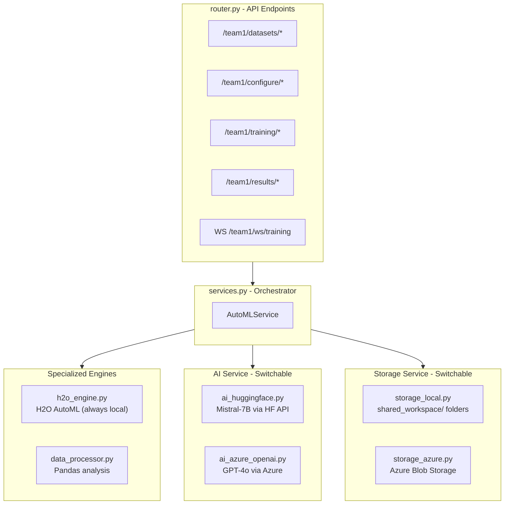

# AI Kosh -- Team 1 AutoML Wizard (Revised Plan)

## What Changed From the Previous Plan

The two docx files define a **team-based project structure** managed by an Integration Team. We are **Team 1 (AutoML)**. We do NOT build the entire app from scratch. Instead:

- **Backend**: Our code lives inside `modules/team1_automl/` within the larger `AI_Kosh_Project/` structure
- **Frontend**: Our code lives inside `src/pages/model-exchange/tools/` within the larger `UI_kosh/` structure
- The Integration Team owns `main.py`, `App.tsx`, auth, navbar, routing
- We must follow specific conventions (router.py for endpoints only, `onBack` prop, `aw-` CSS prefix, `shared_workspace/` for data)
- We use `run_local.py` to test our backend independently

---

## Project Structure (What We Build)

### Backend -- `modules/team1_automl/`

```
modules/team1_automl/
├── router.py                  # MANDATORY: All API endpoints (thin layer, delegates to services)
├── services.py                # Core business logic orchestrator
├── run_local.py               # Independent test server (mounts router on port 8001)
├── team_db.py                 # SQLite DB for training runs metadata (team1_automl.db)
├── h2o_engine.py              # H2O AutoML wrapper (init, train, leaderboard, varimp, save)
├── data_processor.py          # Pandas: column stats, types, nulls, preview, profiling
├── ai_huggingface.py          # Open-source AI: column recommendation via HF Inference API
├── ai_azure_openai.py         # Azure AI: column recommendation via Azure OpenAI (Phase 2)
├── ai_service.py              # Factory: returns HF or Azure AI service based on config
├── storage_local.py           # Local filesystem storage (read/write to shared_workspace/)
├── storage_azure.py           # Azure Blob Storage (Phase 2)
├── storage_service.py         # Factory: returns local or Azure storage based on config
├── config.py                  # Toggle logic: auto-detect .env to switch local vs Azure
├── schemas.py                 # Pydantic request/response models
└── enums.py                   # MLTask, ModelType, TrainingStatus enums
```

### Frontend -- `src/pages/model-exchange/tools/`

```
src/pages/model-exchange/tools/
├── AutoMLWizard.tsx           # Main entry component (accepts onBack prop)
├── AutoMLWizard.css           # All styles with aw- prefix
├── api.ts                     # Backend API client (uses VITE_API_URL)
├── components/
│   ├── WizardStepper.tsx      # 5-step horizontal stepper
│   ├── StepSelectDataset.tsx  # Step 1: Upload CSV, browse catalog, metadata
│   ├── StepConfigureData.tsx  # Step 2: Column table, AI recommendation panel
│   ├── StepConfiguration.tsx  # Step 3: Task cards, model cards, hyperparams
│   ├── StepTraining.tsx       # Step 4: Progress pipeline, live log terminal
│   └── StepResults.tsx        # Step 5: Leaderboard, feature importance, export
├── hooks/
│   └── useWebSocket.ts        # WebSocket hook for live training logs
└── types.ts                   # TypeScript interfaces
```

---

## Integration Conventions We Follow

From **AIKoshBackendCodeStructure.docx**:

- `router.py` ONLY contains API endpoints -- all logic in other files
- Data read/write goes through `shared_workspace/` (1_raw_uploads, 2_processed_data, 3_models)
- Our SQLite DB is `team1_automl.db` inside our own folder
- `run_local.py` starts an independent FastAPI server for testing

From **Frontend.docx**:

- Main component `AutoMLWizard.tsx` accepts `{ onBack: () => void }` prop
- All CSS classes use `aw-` prefix (e.g., `aw-wizard`, `aw-stepper`, `aw-card`)
- API calls go through a dedicated `api.ts` using `VITE_API_URL` env variable
- File format must be `.tsx`

---

## Architecture -- Switchable Services




`config.py` auto-detects which `.env` keys are present:

- No Azure keys --> `AI_MODE=huggingface`, `STORAGE_MODE=local`
- Azure keys present --> `AI_MODE=azure`, `STORAGE_MODE=azure`

---

## Backend API Endpoints (router.py)

All endpoints are prefixed with `/team1`:

**Dataset Management:**

- `POST /team1/datasets/upload` -- Upload CSV to shared_workspace/1_raw_uploads/
- `GET /team1/datasets` -- List available datasets
- `GET /team1/datasets/{id}/preview` -- First N rows
- `GET /team1/datasets/{id}/columns` -- Column metadata (types, nulls, uniques)

**Column Configuration:**

- `POST /team1/configure/ai-recommend` -- AI-powered target/feature recommendation
- `POST /team1/configure/validate` -- Validate selected configuration

**Training:**

- `POST /team1/training/start` -- Start H2O AutoML training
- `GET /team1/training/{run_id}/status` -- Training status
- `WebSocket /team1/ws/training/{run_id}` -- Live logs stream
- `POST /team1/training/{run_id}/stop` -- Stop training

**Results:**

- `GET /team1/results/{run_id}/leaderboard` -- Ranked model list
- `GET /team1/results/{run_id}/best-model` -- Best model details
- `GET /team1/results/{run_id}/feature-importance` -- Feature importance data
- `GET /team1/results/{run_id}/confusion-matrix` -- Confusion matrix (classification)
- `GET /team1/results/{run_id}/residuals` -- Residual plot data (regression)
- `GET /team1/results/{run_id}/export` -- Download results CSV/JSON

---

## Frontend -- 5-Step Wizard UI (from 12 screenshots)

Matching the NTT DATA AI Kosh reference exactly:

**Step 1 - Select Dataset** (screenshots 1.jpeg):

- "AutoML Wizard" title + subtitle
- 5-step horizontal stepper (green check = done, orange = active, gray = pending)
- Back button, dataset name (fe_data.csv), description
- Metadata cards: Total Rows, Total Columns, Size, Category badge
- Right sidebar: "AutoML Workflow" checklist

**Step 2 - Configure Data** (screenshots 2.jpeg, 3.jpeg, 4.jpeg):

- Two tabs: "Column Configuration" | "Dataset Preview"
- Column table: checkbox, column name, type badge (object/float64/int64), null count, unique count, target radio
- Right panel: "AI Assistant" with text input, "Generate Configuration" orange button
- AI Recommendation card: confidence badge, target column highlight, features count, reasoning text
- Orange "Continue" button at bottom

**Step 3 - Configuration** (screenshots 5.jpeg, 6.jpeg, 7.jpeg, 8.jpeg, 9.jpeg):

- Auto Mode toggle (on/off)
- When off: "Select ML Task" with 3 cards (Classification, Regression, Clustering)
- "Select Models to Train" with 6 cards: DRF (Medium), GLM (Fast), XGBoost (Medium), GBM (Medium), Deep Learning (Slow), Stacked Ensemble (Slow)
- "Select Hyperparameters" with Basic/Advanced tabs
- Basic: Train/Test Split dropdown (80/20), Cross-validation Folds dropdown
- Advanced: Maximum Models (20), Maximum Runtime(s) (300)
- Orange "Start Training" button

**Step 4 - Training** (screenshots 10.jpeg, 11.jpeg, 12.jpeg):

- "Starting" spinner animation
- Progress pipeline: Queued -> Data Check -> Features -> Training -> Evaluation -> Complete
- Percentage indicator
- "Live Training Logs" section with dark terminal, filter input, auto-scroll toggle, copy button
- "Training Status" panel: Status (Waiting/Running/Complete), Total Logs count
- "Tips" panel with helpful hints

**Step 5 - Results** (no screenshot, from implementation_plan.md):

- Leaderboard table ranked by metric
- Best model highlighted with badge
- Feature importance bar chart
- Model comparison charts
- Confusion matrix (classification) / Residual plots (regression)
- Export button (CSV/JSON)

---

## Dependencies

**Backend (`requirements.txt` additions):**

```
fastapi
uvicorn
python-multipart
python-dotenv
h2o
pandas
numpy
scikit-learn
huggingface_hub
openai
azure-storage-blob
websockets
matplotlib
aiofiles
```

**Frontend (`package.json` additions):**

```
recharts
axios
```

**System prerequisites:**

- Python 3.10+
- Java 17+ (JDK for H2O) -- [https://adoptium.net](https://adoptium.net)
- Node.js 18+

---

## Implementation Order

### Phase 1: Backend Foundation (run_local.py works)

**Step 1 -- Scaffold + Config + H2O Test**

- Create all files in `modules/team1_automl/`
- `config.py` with auto-toggle, `enums.py`, `schemas.py`
- `h2o_engine.py` -- test `h2o.init()` works
- `run_local.py` -- standalone FastAPI on port 8001
- `router.py` skeleton with all endpoint stubs

**Step 2 -- Dataset Upload + Storage**

- `storage_local.py` -- save CSVs to `shared_workspace/1_raw_uploads/`, models to `shared_workspace/3_models/`
- `data_processor.py` -- Pandas column analysis, preview, profiling
- `team_db.py` -- SQLite for tracking datasets and training runs
- Wire up `/team1/datasets/`* endpoints in router.py

**Step 3 -- AI Service + Column Config**

- `ai_huggingface.py` -- HF Inference API with Mistral-7B for column recommendation
- Rule-based fallback within same file (for offline/rate-limited scenarios)
- `ai_service.py` factory
- Wire up `/team1/configure/`* endpoints

**Step 4 -- H2O Training + WebSocket**

- `h2o_engine.py` full implementation (init, configure, train, leaderboard, varimp, save)
- Training runs tracked in SQLite
- WebSocket endpoint for live progress streaming
- Wire up `/team1/training/`* endpoints

**Step 5 -- Results Endpoints**

- Leaderboard, best model, feature importance, confusion matrix, residuals, export
- Wire up `/team1/results/`* endpoints
- Test full backend pipeline with iris.csv

### Phase 2: Frontend (full 5-step wizard)

**Step 6 -- Wizard Shell + Step 1**

- `AutoMLWizard.tsx` with state management, stepper, step routing
- `WizardStepper.tsx` matching the orange/green/gray stepper from screenshots
- `StepSelectDataset.tsx` -- upload, metadata display
- `AutoMLWizard.css` with `aw-` prefixed classes matching AI Kosh theme
- `api.ts` with all endpoint calls

**Step 7 -- Step 2 (Configure Data) + Step 3 (Configuration)**

- `StepConfigureData.tsx` -- column table, AI assistant panel, recommendation display
- `StepConfiguration.tsx` -- Auto Mode toggle, task cards, model cards, hyperparameters

**Step 8 -- Step 4 (Training) + Step 5 (Results)**

- `StepTraining.tsx` -- progress pipeline, dark log terminal, WebSocket connection
- `StepResults.tsx` -- leaderboard table, feature importance chart, export
- `useWebSocket.ts` hook

### Phase 3: Azure Integration (when access granted)

**Step 9 -- Azure Storage + AI Switch**

- `storage_azure.py` -- Azure Blob implementation (same interface as local)
- `ai_azure_openai.py` -- Azure OpenAI implementation (same interface as HF)
- Test: add Azure keys to `.env` -> auto-switches

### Phase 4: Polish + Testing

**Step 10 -- Full integration test, edge cases, UI polish**

- Test with iris.csv, housing.csv, customer_churn.csv
- All 3 ML tasks (classification, regression, clustering)
- Error handling, loading states, edge cases
