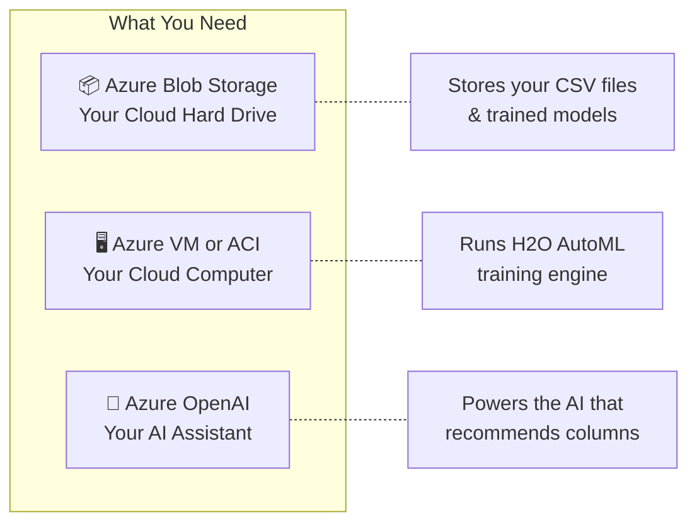
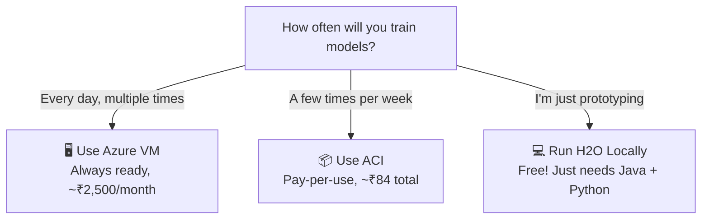
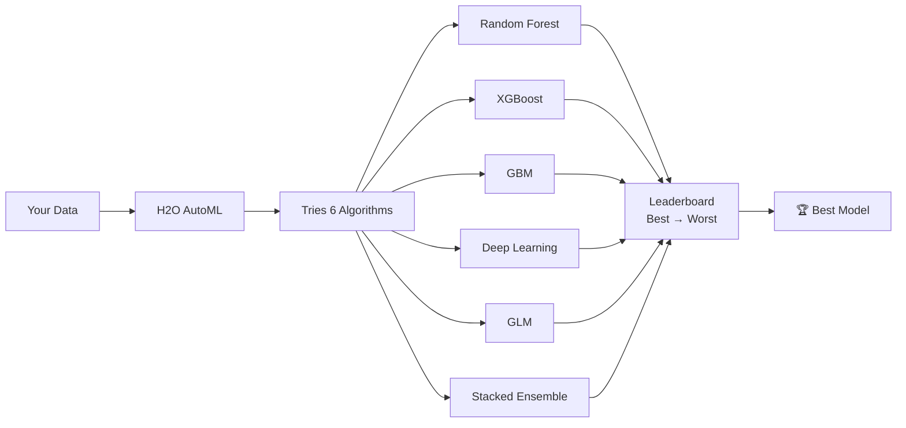
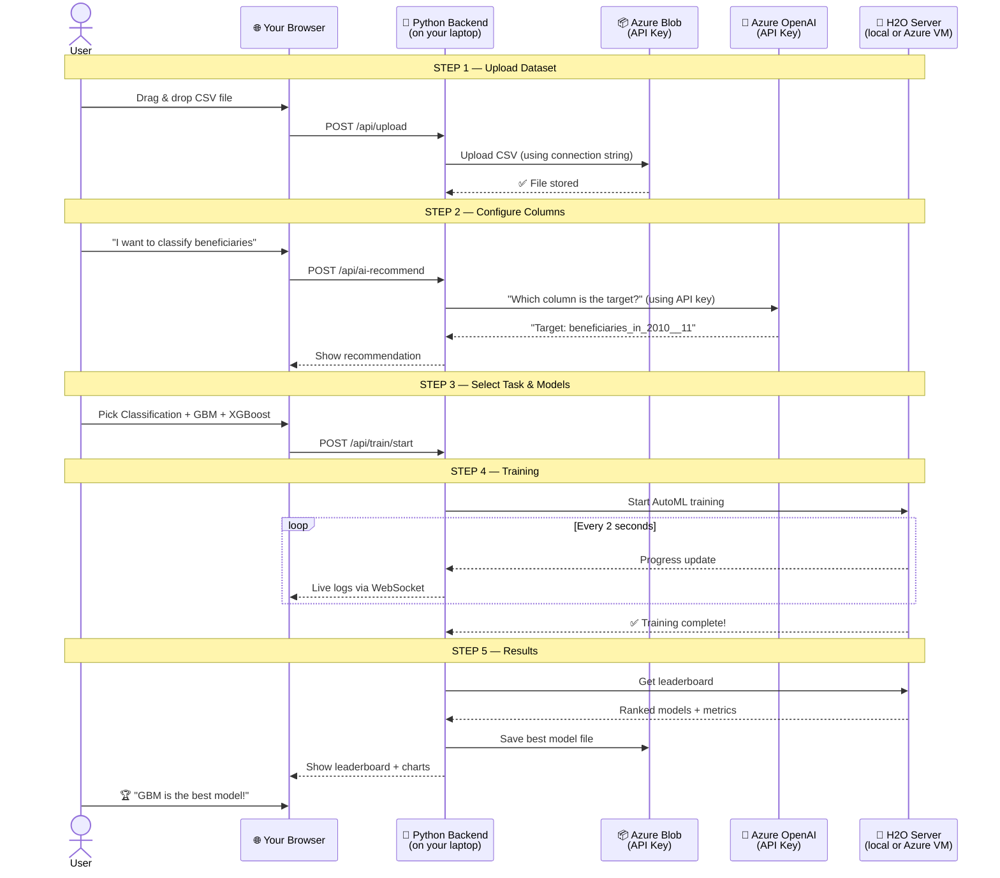

# Azure Services Guide for AutoML Project — Beginner Friendly 🚀

## Think of Azure Like This...

Imagine Azure as a **giant computer shop in the cloud**. Instead of buying physical computers, hard drives, and software — you **rent** them online and pay only for what you use. Everything is accessed through **API keys** (like passwords) and **endpoints** (like addresses).

---

## 1. The 3 Azure Services We Need



---

## 2. Azure Blob Storage — Your Cloud Hard Drive 📦

### What is it?
Think of it as **Google Drive / OneDrive but for code**. It stores files (CSVs, models, images) in the cloud.

### Why do we need it?
- When user uploads a CSV → it goes to Blob Storage
- When H2O trains a model → the model file is saved to Blob Storage
- Anyone can download results from there

### Real-world analogy
> You have a **filing cabinet** in the cloud. You put files in, take files out. That's it.

### How to set it up (step by step)

```
1. Go to portal.azure.com
2. Click "Create a resource"
3. Search "Storage Account" → Click Create
4. Fill in:
   - Resource group: "aikosh-rg" (create new)
   - Storage account name: "aikoshstorage" (must be unique, lowercase, no spaces)
   - Region: "Central India" (closest to you)
   - Performance: "Standard"
   - Redundancy: "LRS" (cheapest)
5. Click "Review + Create" → "Create"
6. Once created, go to the resource
7. Left menu → "Access keys"
8. Copy "Connection string" → This is your API KEY for storage
```

### How to use it in Python

```python
# Install: pip install azure-storage-blob
from azure.storage.blob import BlobServiceClient

# Connect using your connection string (the API key)
connection_string = "DefaultEndpointsProtocol=https;AccountName=aikoshstorage;AccountKey=YOUR_KEY_HERE..."
blob_service = BlobServiceClient.from_connection_string(connection_string)

# Create a container (like a folder)
container = blob_service.create_container("datasets")

# Upload a file
with open("data.csv", "rb") as file:
    blob_service.get_blob_client("datasets", "data.csv").upload_blob(file)

# Download a file
blob_client = blob_service.get_blob_client("datasets", "data.csv")
with open("downloaded_data.csv", "wb") as file:
    file.write(blob_client.download_blob().readall())
```

### Cost
- **~₹4-8 per GB per month** — for our project, basically free (<₹50 total)

---

## 3. Azure VM vs ACI — Your Cloud Computer 🖥️

### The Big Question: Where Does H2O Run?

H2O AutoML is a **Java-based server** that needs to run somewhere. You can't run it in your browser. You need a computer. You have 2 options:

### Option A: Azure VM (Virtual Machine)

#### What is it?
A **full computer in the cloud**. It's like having a desktop PC running 24/7 in Microsoft's data center. You connect to it via Remote Desktop or SSH.

#### Real-world analogy
> You **rent a full apartment**. You have keys, you can go in anytime, leave your stuff there. You pay rent whether you use it or not.

```
Pros:
✅ Always running — H2O server is always ready
✅ Full control — install anything you want
✅ Simple to understand — it's just a computer

Cons:
❌ Costs money 24/7 even when not training
❌ You have to manage it (updates, security)
❌ Need to SSH into it to set things up
```

#### How to set it up

```
1. Go to portal.azure.com
2. Create a resource → "Virtual Machine"
3. Settings:
   - Name: "aikosh-h2o-vm"
   - Region: "Central India"
   - Image: "Ubuntu 22.04 LTS"
   - Size: "Standard_B2s" (2 CPU, 4GB RAM — ₹2,500/month approx)
   - Authentication: Password (simpler for beginners)
   - Username: "azureuser"
   - Password: your-password
4. Networking: Allow port 54321 (H2O) and 22 (SSH)
5. Create
6. Once running, SSH into it:
   ssh azureuser@<VM-PUBLIC-IP>
7. Install H2O:
   sudo apt update
   sudo apt install default-jdk -y
   pip install h2o
   python -c "import h2o; h2o.init()"
```

#### Cost
- **B2s (2 CPU, 4GB RAM):** ~₹2,500/month (~₹85/day)
- **B4ms (4 CPU, 16GB RAM):** ~₹5,500/month (~₹183/day)
- **💡 Tip:** You can **stop the VM** when not using it → no charges!

---

### Option B: Azure Container Instance (ACI)

#### What is it?
A **lightweight, temporary computer** that runs a Docker container. It starts up, does its job, and shuts down. You only pay while it's running.

#### Real-world analogy
> You **book a hotel room**. You use it when you need it, check out when done. You only pay for the nights you stay.

```
Pros:
✅ Pay only when training (cheapest option)
✅ No server management
✅ Starts in ~30 seconds
✅ Perfect for sporadic use

Cons:
❌ Slight startup delay (30-60 seconds)
❌ Less control than a VM
❌ Need to know Docker basics
```

#### How to set it up

```
1. Go to portal.azure.com
2. Create a resource → "Container Instance"
3. Settings:
   - Name: "aikosh-h2o"
   - Region: "Central India"
   - Image source: "Docker Hub"
   - Image: "h2oai/h2o-open-source-k8s"
   - CPU: 2 cores
   - Memory: 4 GB
   - Port: 54321
4. Create
5. It will give you a PUBLIC IP
6. H2O is now running at: http://<PUBLIC-IP>:54321
```

#### Cost
- **2 CPU, 4GB RAM:** ~₹3/hour (only when running!)
- Train for 2 hours/day × 14 days = ~₹84 total 🎉

---

### VM vs ACI — Which Should You Choose?



> [!TIP]
> **My recommendation for your project:** Start with **running H2O locally** on your own machine for development. Use **ACI** only for the final demo. This saves you money during the 2-week development period.

---

## 4. Azure OpenAI — Your AI Assistant 🤖

### What is it?
It's **ChatGPT but hosted on Azure**. Same models (GPT-4, GPT-4o) but accessed through your own Azure account with an API key.

### Why do we need it?
In the app (image 2), there's an **"AI Assistant"** panel that:
- Takes a use case description: *"I want to classify beneficiaries in 2010_11"*
- Recommends the **target column** and **features** automatically
- Provides **reasoning** for its choices

### Real-world analogy
> It's like having a **data scientist on speed dial**. You describe what you want, it tells you how to set up your data.

### How to set it up

```
1. Go to portal.azure.com
2. Create a resource → "Azure OpenAI"
3. ⚠️ NOTE: You may need to request access first
   (Fill form at: https://aka.ms/oai/access)
   Approval usually takes 1-2 business days
4. Once approved & created:
   - Go to Azure OpenAI Studio (oai.azure.com)
   - Click "Deployments" → "Create"
   - Model: "gpt-4o-mini" (cheapest, good enough)
   - Deployment name: "gpt-4o-mini"
5. Go back to Azure Portal → your OpenAI resource
6. Left menu → "Keys and Endpoint"
7. Copy:
   - KEY 1 → This is your API KEY
   - Endpoint → This is your ENDPOINT URL
```

### How to use it in Python

```python
# Install: pip install openai
from openai import AzureOpenAI

client = AzureOpenAI(
    api_key="YOUR_API_KEY_HERE",
    api_version="2024-02-01",
    azure_endpoint="https://your-resource.openai.azure.com/"
)

# Ask it to recommend columns
response = client.chat.completions.create(
    model="gpt-4o-mini",  # your deployment name
    messages=[
        {"role": "system", "content": "You are a data science assistant. Given dataset columns, recommend the target variable and features."},
        {"role": "user", "content": """
            My use case: I want to classify beneficiaries in 2010_11
            
            Columns:
            - sl_no_ (object, 0 nulls, 10 unique)
            - name_of_the_district (object, 0 nulls, 10 unique)
            - beneficiaries_in_2010__11 (float64, 2 nulls, 8 unique)
            - beneficiaries_in_2011__12 (float64, 2 nulls, 8 unique)
            - beneficiaries_in_2012__13 (float64, 2 nulls, 8 unique)
            
            Which column should be the target? Which should be features?
        """}
    ]
)

print(response.choices[0].message.content)
# Output: "Target: beneficiaries_in_2010__11, Features: all others except sl_no_"
```

### Cost
- **GPT-4o-mini:** ~₹1 per 1000 requests — practically free for our use
- **GPT-4o:** ~₹10 per 1000 requests — if you want smarter recommendations

### What If You Don't Have Azure OpenAI Access?

> [!IMPORTANT]
> If Azure OpenAI approval takes too long, we have a **fallback plan**: a simple rule-based recommender that picks target based on column names/types. This works but isn't as smart.

---

## 5. H2O AutoML — The Brain of the Project 🧠

### What is it?
H2O is an **open-source machine learning platform**. H2O AutoML is its feature that **automatically tries many ML algorithms and finds the best one**.

### What it does FOR YOU (automatically):



### How it works (simple explanation):

```
Step 1: You give it data + target column
Step 2: It automatically:
   - Handles missing values
   - Encodes text columns to numbers
   - Tries Random Forest with 50 different settings
   - Tries XGBoost with 50 different settings
   - Tries GBM with 50 different settings
   - Tries GLM, Deep Learning, etc.
   - Cross-validates each model (tests on unseen data)
Step 3: It ranks ALL models by accuracy (or RMSE for regression)
Step 4: It gives you a LEADERBOARD — you pick the winner!
```

### How to run H2O locally (for development):

```bash
# Step 1: Install Java (H2O needs it)
# Download from: https://adoptium.net/ (Temurin JDK 17)

# Step 2: Install H2O Python package
pip install h2o

# Step 3: Start H2O and train!
python
```

```python
import h2o
from h2o.automl import H2OAutoML

# Start H2O (launches a local Java server)
h2o.init()
# This will print: H2O cluster running at http://127.0.0.1:54321

# Load your data
data = h2o.import_file("your_data.csv")

# Tell it what to predict
target = "beneficiaries_in_2010__11"
features = [c for c in data.columns if c != target]

# Make it a classification problem
data[target] = data[target].asfactor()

# Run AutoML — this is the MAGIC LINE
aml = H2OAutoML(
    max_models=20,       # Try up to 20 models
    max_runtime_secs=300, # Stop after 5 minutes
    seed=42,              # For reproducibility
    nfolds=5              # 5-fold cross-validation
)
aml.train(x=features, y=target, training_frame=data)

# See the leaderboard!
print(aml.leaderboard)
# Output:
# ┌──────────────────────────┬──────────┬──────────┐
# │ model_id                 │   auc    │ logloss  │
# ├──────────────────────────┼──────────┼──────────┤
# │ GBM_1                   │ 0.95     │ 0.12     │  ← BEST!
# │ XGBoost_3               │ 0.93     │ 0.15     │
# │ DRF_2                   │ 0.91     │ 0.18     │
# │ DeepLearning_1          │ 0.89     │ 0.22     │
# │ GLM_1                   │ 0.85     │ 0.30     │
# └──────────────────────────┴──────────┴──────────┘

# Get the best model
best = aml.leader
print(f"Best model: {best.model_id}")
print(f"Best AUC: {best.auc()}")

# See which features matter most
print(best.varimp(use_pandas=True))

# Save the model
h2o.save_model(best, path="./saved_models")
```

---

## 6. How Everything Connects — The Full Picture



---

## 7. Quick Setup Checklist (Do This First)

### Prerequisites (install on your laptop):

```bash
# 1. Install Python 3.10+ (if not already)
# Download: https://www.python.org/downloads/

# 2. Install Java 17 (needed for H2O)
# Download: https://adoptium.net/

# 3. Install Node.js 18+ (for React frontend)
# Download: https://nodejs.org/

# 4. Verify installations
python --version    # Should show 3.10+
java -version       # Should show 17+
node --version      # Should show 18+
```

### Azure Setup (takes ~30 minutes):

| Step | Action | Time |
|------|--------|------|
| 1 | Create Azure account at [portal.azure.com](https://portal.azure.com) | 5 min |
| 2 | Create Resource Group: `aikosh-rg` | 2 min |
| 3 | Create Storage Account → copy Connection String | 5 min |
| 4 | Create a Blob container called `datasets` | 2 min |
| 5 | Request Azure OpenAI access (if needed) | 2 min (then wait 1-2 days) |
| 6 | *Optional:* Create Azure VM for H2O | 10 min |

> [!TIP]
> **For the first few days of development, you DON'T need Azure at all!** Run H2O locally on your laptop with `h2o.init()`. Add Azure only in Week 2 when connecting everything together.

---

## 8. Glossary — Key Terms Explained

| Term | Simple Explanation |
|------|-------------------|
| **API Key** | A password/token that lets your code access a cloud service |
| **Endpoint** | A URL address where the cloud service lives (like a phone number) |
| **Blob Storage** | Cloud file storage (like Google Drive for code) |
| **VM (Virtual Machine)** | A full computer running in the cloud, always on |
| **ACI (Container Instance)** | A temporary lightweight computer, starts/stops on demand |
| **Azure OpenAI** | ChatGPT running on your Azure account |
| **H2O AutoML** | Software that automatically tries many ML models and finds the best one |
| **Docker** | A way to package software so it runs the same everywhere |
| **SSH** | Secure way to connect to a remote computer via terminal |
| **WebSocket** | A persistent connection for real-time data (like live chat) |
| **FastAPI** | Python framework for building REST APIs quickly |
| **Cross-validation** | Testing a model on different data splits to check reliability |
| **Leaderboard** | Ranked list of models from best to worst performance |
| **Feature importance** | Which columns/variables matter most for predictions |
| **RMSE** | Error metric for regression (lower = better) |
| **AUC** | Accuracy metric for classification (higher = better, max 1.0) |
