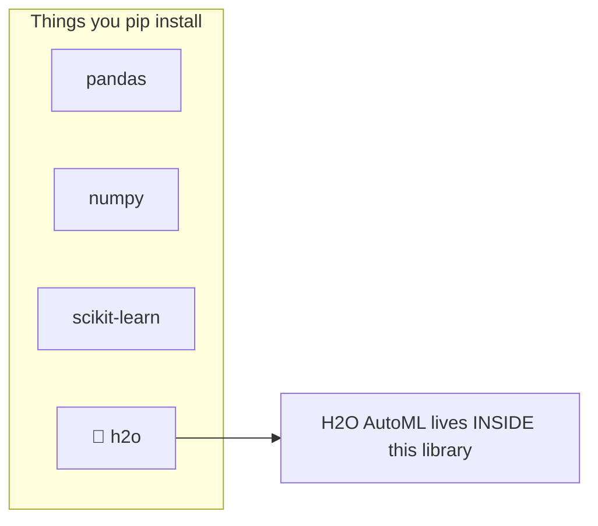
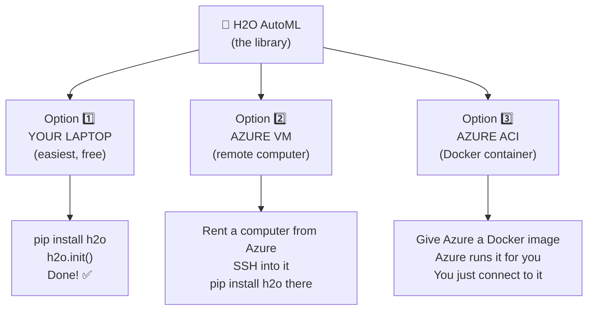
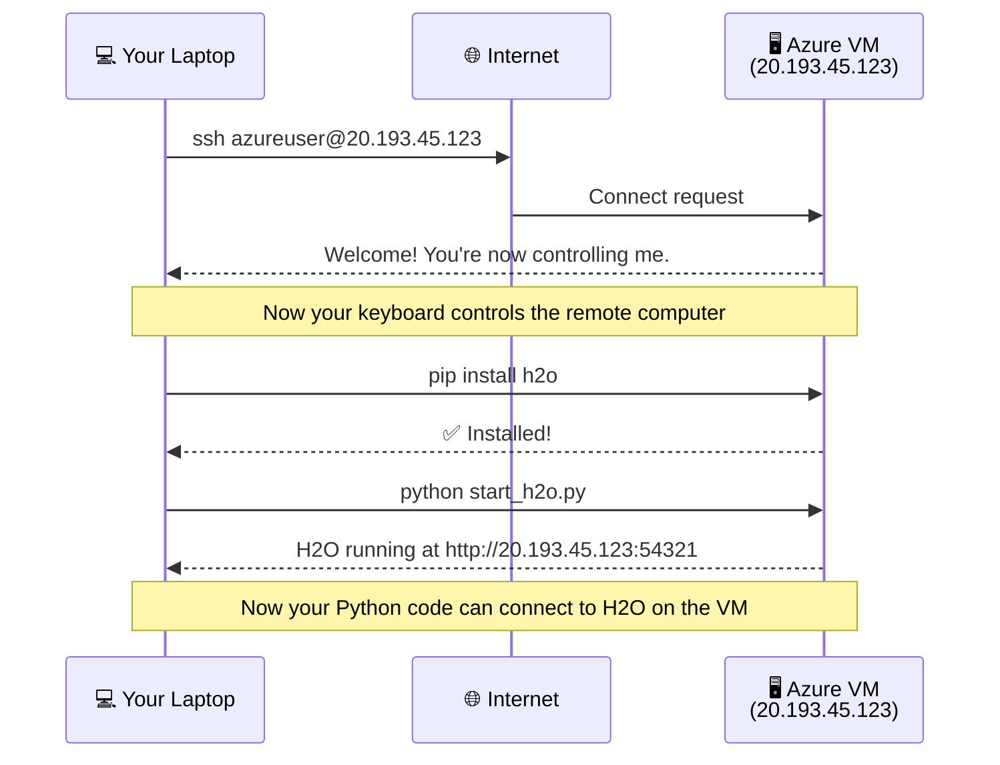
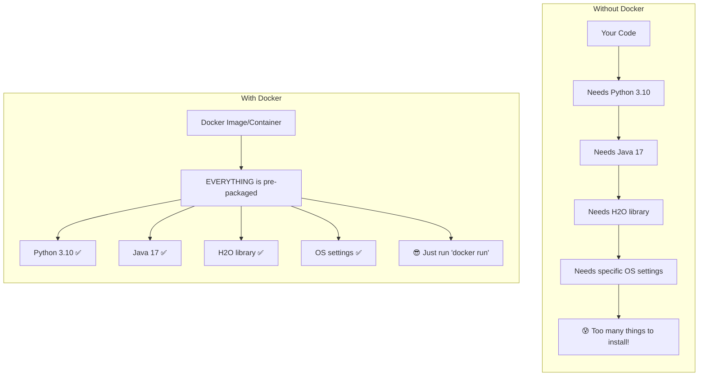
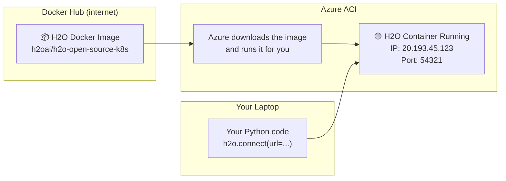
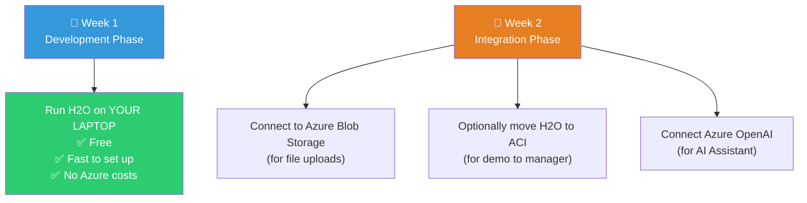

# H2O AutoML, Docker & Remote Computers — Explained Simply 🎓

---

## 1. What Exactly is H2O AutoML?

### It's a FREE Python Library (like pandas or numpy)



**H2O AutoML is NOT an Azure service.** It's an **open-source Python library** that you install with:

```bash
pip install h2o
```

That's it. It's free. No Azure needed to use it.

### So where does Azure come in?

Azure is just the **place where we RUN the H2O code**. Think of it like this:

| What | Analogy |
|------|---------|
| **H2O AutoML** | A recipe book 📖 |
| **Your laptop** | Your home kitchen 🏠 |
| **Azure VM** | A commercial kitchen you rent 🏪 |
| **The food you cook** | Your trained ML models 🍕 |

You can cook (run H2O) in your home kitchen (laptop) OR in a rented commercial kitchen (Azure). **The recipe is the same**. Azure just gives you a bigger kitchen with more power.

### Three Ways to Run H2O



---

## 2. Option 1: Run H2O on Your Laptop (START HERE!) 💻

This is the **simplest approach**. No Azure, no Docker, no SSH. Just your computer.

### Step-by-step:

```
Step 1: Install Java (H2O needs Java to run)
        → Download from https://adoptium.net
        → Install it like any normal app
        → It's like installing a "engine" that H2O needs

Step 2: Install H2O
        → Open your terminal/command prompt
        → Type: pip install h2o
        → Wait 2 minutes... done!

Step 3: Run it!
```

```python
import h2o
from h2o.automl import H2OAutoML

# This starts H2O on YOUR laptop
# Behind the scenes, it starts a small Java server
h2o.init()

# You'll see something like:
# ✅ H2O cluster running at http://127.0.0.1:54321
# (This means H2O is running on YOUR machine at port 54321)

# Load data
data = h2o.import_file("your_data.csv")

# Train models automatically
aml = H2OAutoML(max_models=10, max_runtime_secs=120)
aml.train(x=features, y=target, training_frame=data)

# See results
print(aml.leaderboard)  # Shows best models!
```

### When your laptop is NOT enough:
- Your dataset is **very large** (millions of rows)
- Training takes **hours** and you need your laptop for other work
- You want training to run **24/7 without keeping your laptop open**

👆 **That's when you move to Azure (Options 2 or 3)**

---

## 3. What is a "Remote Computer"? 🖥️☁️

### The Problem
Your laptop has limited power. What if you need a computer with:
- 16 GB RAM (your laptop may have 8 GB)
- 8 CPU cores (your laptop may have 4)
- Running 24/7 (you close your laptop at night)

### The Solution: Rent a Computer from Microsoft

```
YOUR LAPTOP                          AZURE DATA CENTER (somewhere in India)
┌──────────────┐                     ┌──────────────────────────────┐
│              │                     │ 🏢 Microsoft's Building      │
│   You sit    │   ── Internet ──►   │                              │
│   here       │                     │   ┌──────────────────────┐   │
│              │                     │   │ YOUR RENTED COMPUTER │   │
│   💻         │                     │   │ (Azure VM)           │   │
│              │                     │   │  - Ubuntu Linux      │   │
└──────────────┘                     │   │  - 4 CPU, 16GB RAM   │   │
                                     │   │  - Running 24/7      │   │
                                     │   │  - Has its own IP    │   │
                                     │   └──────────────────────┘   │
                                     └──────────────────────────────┘
```

**An Azure VM is literally a computer that Microsoft owns, and you rent it.** It runs Linux (usually Ubuntu), and you control it remotely.

---

## 4. What is SSH? 🔌

### SSH = Remote Control for Computers

SSH stands for "**S**ecure **Sh**ell". It lets you **type commands on a remote computer** from your laptop.

### Real-World Analogy

```
Imagine you have a friend in another city who has a powerful computer.
You call them on the phone and say:
  "Hey, open the terminal and type 'pip install h2o'"
They type it, and the software installs on THEIR computer.

SSH is exactly this, but automated. 
Instead of calling a friend, your terminal directly 
connects to the remote computer.
```

### What it looks like in practice:

```bash
# From YOUR laptop's terminal, you type:
ssh azureuser@20.193.45.123

# Now your terminal is connected to the Azure VM!
# Everything you type runs on the REMOTE computer, not yours.

# You see:
azureuser@aikosh-vm:~$

# Now install H2O on the remote computer
azureuser@aikosh-vm:~$ pip install h2o

# Start H2O on the remote computer
azureuser@aikosh-vm:~$ python -c "import h2o; h2o.init()"

# H2O is now running on the Azure VM at:
# http://20.193.45.123:54321
```

### Visual flow:



### After SSH setup, your Python code connects like this:

```python
import h2o

# Instead of h2o.init() (which starts H2O locally),
# you CONNECT to the H2O already running on Azure VM:
h2o.connect(url="http://20.193.45.123:54321")

# Everything else is EXACTLY THE SAME!
data = h2o.import_file("data.csv")
aml = H2OAutoML(max_models=10)
aml.train(x=features, y=target, training_frame=data)
print(aml.leaderboard)
```

**The only difference:** `h2o.init()` vs `h2o.connect(url="...")`. That's it!

---

## 5. What is Docker? 📦

### The Problem Docker Solves

Imagine you wrote some Python code that works perfectly on your laptop. You give it to your colleague. They try to run it and get:

```
❌ Error: Java version 17 required, you have version 11
❌ Error: Missing package 'h2o'
❌ Error: Wrong Python version
```

**Docker solves this by packaging EVERYTHING together.**

### Real-World Analogy

```
WITHOUT Docker:
  📝 Recipe: "Make pizza"
  🤷 "But I don't have an oven!"
  🤷 "I don't have the right flour!"
  🤷 "My kitchen is different from yours!"

WITH Docker:
  📦 A box arrives at your door containing:
     ✅ A portable oven
     ✅ All ingredients
     ✅ The recipe
     ✅ A mini kitchen counter
  🍕 Just open the box and start cooking!
```

### In Technical Terms



### Docker Terms Simplified

| Term | Analogy | Meaning |
|------|---------|---------|
| **Docker Image** | A recipe + ingredients list | A blueprint/template of a pre-configured computer |
| **Docker Container** | The actual cooked dish | A running instance of that image |
| **Docker Hub** | A recipe website (like YouTube for recipes) | Online store where people share Docker images |
| **docker run** | "Start cooking!" | Command to create a container from an image |

### H2O Already Has a Docker Image!

Someone at H2O already created a Docker image with everything pre-installed. You just use it:

```bash
# This ONE command does everything:
# - Downloads H2O + Java + Python (from Docker Hub)
# - Creates a container
# - Starts H2O server
docker run -p 54321:54321 h2oai/h2o-open-source-k8s

# H2O is now running at http://localhost:54321
# That's it. No installing Java, no pip install, nothing.
```

---

## 6. How Docker + Azure ACI Work Together

**ACI (Azure Container Instance)** is basically Azure saying:
> *"Give me a Docker image, and I'll run it on my computers. You don't even need to manage the computer."*



### ACI Setup (Azure Portal — no Docker installed on YOUR laptop!)

```
1. Go to portal.azure.com
2. Search "Container Instances" → Create
3. Fill in:
   - Container name: "h2o-automl"
   - Image source: "Docker Hub" (public)
   - Image: "h2oai/h2o-open-source-k8s"
   - CPU: 2
   - Memory: 4 GB
4. Networking tab:
   - Port: 54321
5. Click Create

Azure will:
  → Download the H2O Docker image
  → Start a container  
  → Give you a public IP address

6. Your H2O is now at: http://<PUBLIC_IP>:54321
```

**You don't need Docker installed on your laptop for ACI!** Azure handles it all.

---

## 7. Comparison — All 3 Options Side by Side

```
┌─────────────────┬─────────────────────┬─────────────────────┬──────────────────────┐
│                 │  Option 1: LAPTOP   │  Option 2: AZURE VM │  Option 3: AZURE ACI │
├─────────────────┼─────────────────────┼─────────────────────┼──────────────────────┤
│ What is it?     │ H2O runs on YOUR    │ H2O runs on a       │ H2O runs in a Docker │
│                 │ computer            │ rented computer you  │ container Azure      │
│                 │                     │ control via SSH      │ manages for you      │
├─────────────────┼─────────────────────┼─────────────────────┼──────────────────────┤
│ Setup Effort    │ ⭐ Easiest          │ ⭐⭐⭐ Hardest      │ ⭐⭐ Medium          │
│                 │ pip install h2o     │ Create VM, SSH in,   │ Point & click in     │
│                 │                     │ install everything   │ Azure Portal         │
├─────────────────┼─────────────────────┼─────────────────────┼──────────────────────┤
│ Cost            │ FREE ₹0             │ ~₹85/day             │ ~₹3/hour             │
│                 │                     │ (even when idle)     │ (only when running)  │
├─────────────────┼─────────────────────┼─────────────────────┼──────────────────────┤
│ Power           │ Limited by your     │ You choose RAM/CPU   │ You choose RAM/CPU   │
│                 │ laptop (4-8GB RAM)  │ (up to 64GB RAM)     │ (up to 16GB RAM)     │
├─────────────────┼─────────────────────┼─────────────────────┼──────────────────────┤
│ When to use     │ Development &       │ Heavy training,      │ Occasional training, │
│                 │ small datasets      │ large datasets       │ demo/presentation    │
├─────────────────┼─────────────────────┼─────────────────────┼──────────────────────┤
│ Need Docker?    │ ❌ No               │ ❌ No (install H2O   │ ❌ No (Azure handles │
│                 │                     │ directly via pip)    │ Docker for you)      │
├─────────────────┼─────────────────────┼─────────────────────┼──────────────────────┤
│ Need SSH?       │ ❌ No               │ ✅ Yes               │ ❌ No                │
├─────────────────┼─────────────────────┼─────────────────────┼──────────────────────┤
│ Python code     │ h2o.init()          │ h2o.connect(url=...) │ h2o.connect(url=...) │
│ difference      │                     │                      │                      │
└─────────────────┴─────────────────────┴─────────────────────┴──────────────────────┘
```

---

## 8. My Recommendation for Your 2-Week Project



### Week 1: Just do `pip install h2o` and build everything locally
### Week 2: Add Azure services one by one (Blob Storage first, then OpenAI, then optionally ACI)

> [!TIP]
> **You can complete this ENTIRE project with H2O running locally.** Azure VM/ACI is only needed if your dataset is too large for your laptop or you want to impress your manager with "cloud infrastructure". The code difference is literally ONE line: `h2o.init()` → `h2o.connect(url="...")`.
