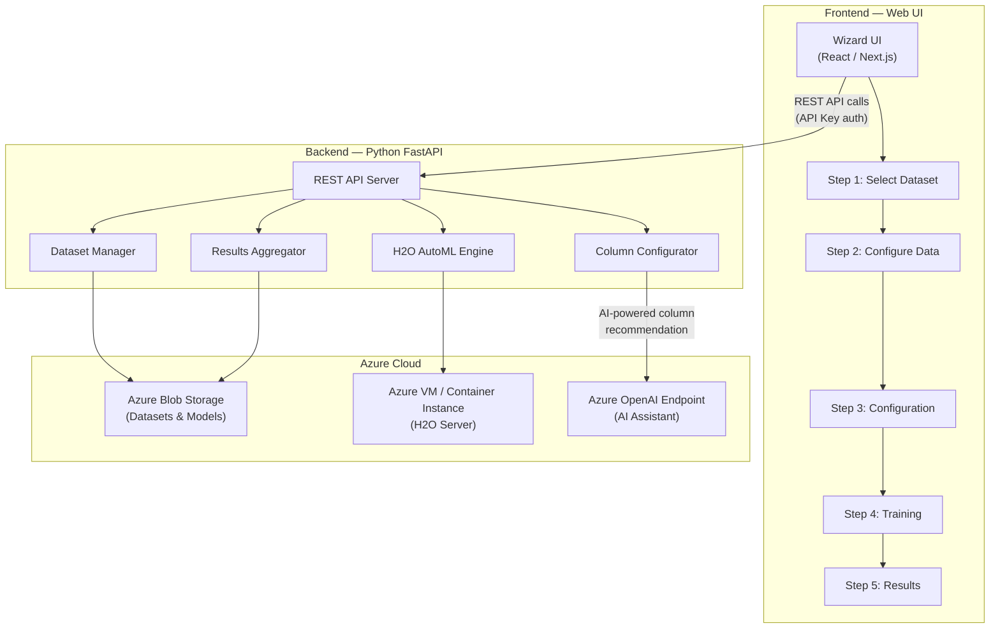
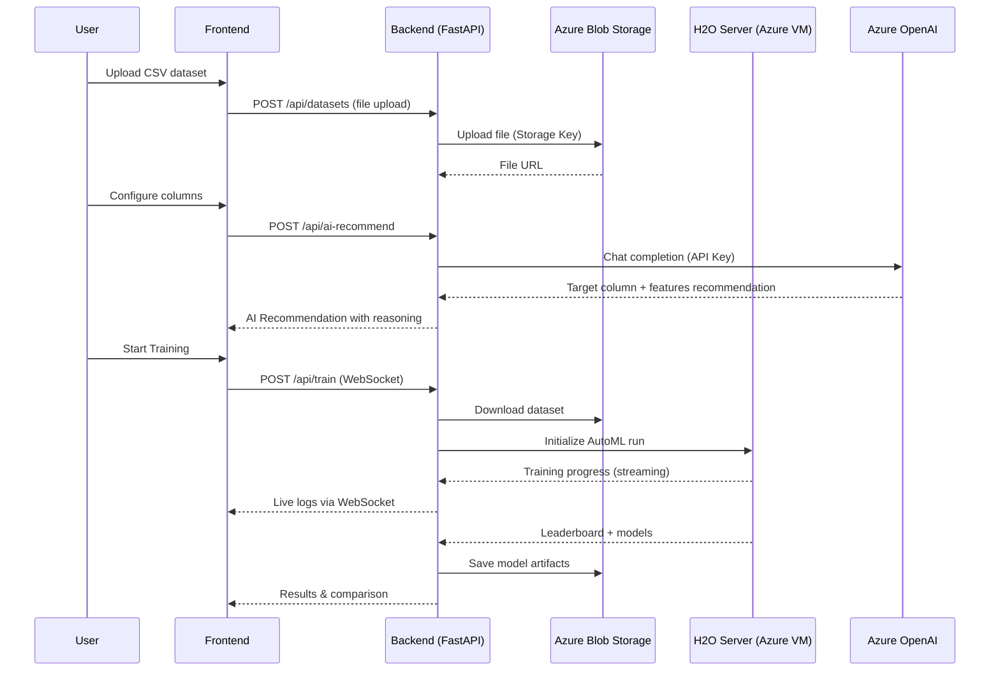
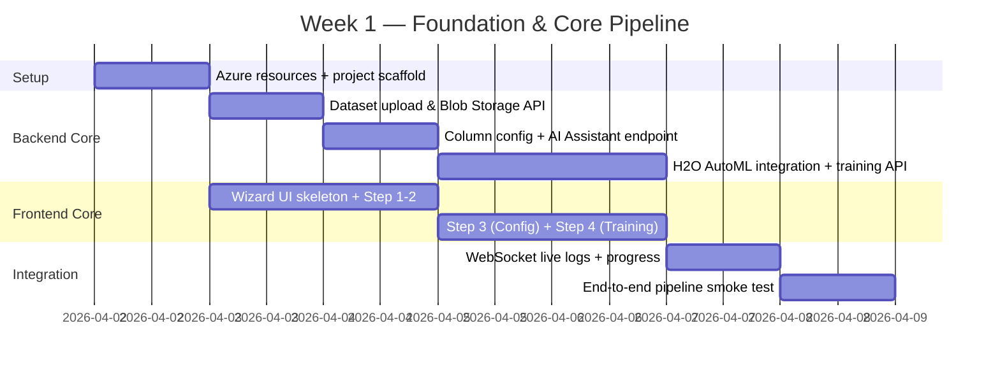
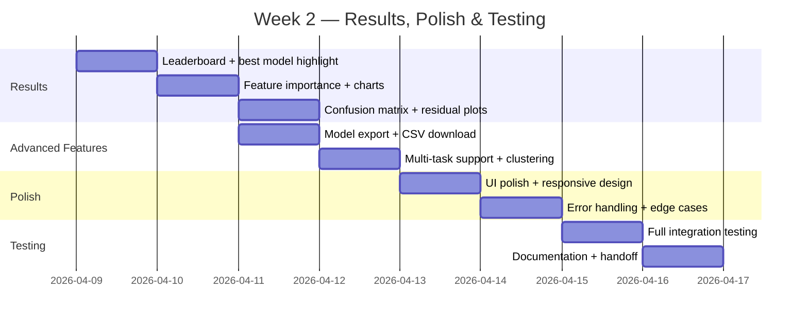

# AI Kosh AutoML Pipeline — Implementation Plan

**Project:** End-to-End Automated Machine Learning Pipeline with H2O AutoML & Azure  
**Timeline:** 2 Weeks (April 2 – April 16, 2026)  
**Scope:** Model selection & comparison only (no deployment)  
**Date:** April 2, 2026

---

## 1. Executive Summary

Build an **AutoML Wizard** web application (modeled after the NTT DATA AI Kosh platform) that allows users to upload datasets, configure columns, select ML tasks, train multiple models via **H2O AutoML**, and view a leaderboard of the best-fitting models — all powered through **Azure cloud infrastructure** using API keys/endpoints. No deployment step is needed; the goal is purely **model discovery and comparison**.

### Reference UI (from screenshots)

The application follows a **5-step wizard** flow:

````carousel

<!-- slide -->

<!-- slide -->

````

---

## 2. Architecture Overview



### Key Design Decisions

| Decision | Choice | Rationale |
|----------|--------|-----------|
| **ML Engine** | H2O AutoML (Java-based, runs on Azure VM) | Built-in algorithm selection, hyperparameter tuning, cross-validation, leaderboard |
| **Backend** | Python FastAPI | Excellent H2O Python client support, async WebSocket for live logs |
| **Frontend** | React (Next.js or Vite) | Wizard step pattern, real-time updates via WebSocket |
| **Azure Integration** | API Key / Endpoint only | Simplifies auth — no Azure AD, no complex IAM |
| **AI Assistant** | Azure OpenAI GPT endpoint | Powers the "AI Recommendation" feature for column/task config |
| **Storage** | Azure Blob Storage | Dataset upload, model artifact persistence |

---

## 3. Azure Integration Strategy (API Key / Endpoint Only)

> [!IMPORTANT]
> All Azure services are accessed exclusively via **API Key + Endpoint URL** — no Azure AD, no managed identities, no complex deployment. This keeps the implementation simple and focused.

### 3.1 Azure Services Required

| Service | Purpose | Auth Method | Estimated Cost (2 weeks) |
|---------|---------|-------------|--------------------------|
| **Azure Blob Storage** | Store uploaded datasets & trained model artifacts | Storage Account Key + Endpoint | ~$2-5 |
| **Azure Container Instance (ACI)** or **Azure VM (B2s)** | Run H2O AutoML server | SSH/API Key | ~$15-30 (B2s VM) |
| **Azure OpenAI Service** | AI Assistant for column recommendation | API Key + Endpoint | ~$5-10 |
| **Total** | | | **~$22-45** |

### 3.2 Configuration File (Simple `.env`)

```env
# Azure Blob Storage
AZURE_STORAGE_CONNECTION_STRING=DefaultEndpointsProtocol=https;AccountName=aikosh;AccountKey=YOUR_KEY;EndpointSuffix=core.windows.net
AZURE_STORAGE_CONTAINER=datasets

# Azure OpenAI (AI Assistant)
AZURE_OPENAI_ENDPOINT=https://your-resource.openai.azure.com/
AZURE_OPENAI_API_KEY=your-api-key-here
AZURE_OPENAI_DEPLOYMENT=gpt-4o

# H2O Server (running on Azure VM/ACI)
H2O_SERVER_URL=http://your-azure-vm-ip:54321
H2O_API_KEY=optional-if-secured
```

### 3.3 How Each Azure Service Is Used



---

## 4. Detailed Feature Breakdown

### 4.1 Step 1 — Select Dataset

| Feature | Description |
|---------|-------------|
| Dataset catalog | Browse previously uploaded datasets from Azure Blob |
| CSV upload | Upload new `.csv` files (drag & drop) |
| Dataset metadata | Display: file name, total rows, total columns, size, category |
| Dataset preview | Show first 10 rows of data in a table |

### 4.2 Step 2 — Configure Data (Column Configuration)

| Feature | Description |
|---------|-------------|
| Column listing | Show all columns with data type (`object`, `float64`, `int64`), null count, unique values |
| Target selection | Checkbox to mark one column as the target variable |
| Feature selection | Checkboxes to include/exclude feature columns |
| **AI Assistant** | Text input: "Describe your use case" → Azure OpenAI generates target + feature recommendations with confidence score and reasoning |
| Dataset preview tab | Toggle between Column Configuration and Dataset Preview |

### 4.3 Step 3 — Configuration (ML Task & Model Selection)

| Feature | Description |
|---------|-------------|
| Auto Mode toggle | System automatically selects best ML task and models |
| ML Task selection | **Classification** (categorical outcomes), **Regression** (continuous values), **Clustering** (group similar data) |
| Model selection cards | Checkboxes for each algorithm with speed indicator: |
| | • Distributed Random Forest — 🟠 Medium |
| | • Generalized Linear Model — 🟢 Fast |
| | • XGBoost — 🟠 Medium |
| | • Gradient Boosting Machine — 🟠 Medium |
| | • Deep Learning — 🔴 Slow |
| | • Stacked Ensemble — 🔴 Slow |
| Hyperparameters | **Basic**: Train/Test split (80/20, 70/30, etc.), Cross-validation folds |
| | **Advanced**: Maximum models (default: 20), Maximum runtime in seconds (default: 300) |
| Start Training button | Orange CTA button to begin |

### 4.4 Step 4 — Training (Live Progress)

| Feature | Description |
|---------|-------------|
| Progress pipeline | Visual stages: Queued → Data Check → Features → Training → Evaluation → Complete |
| Progress percentage | Real-time percentage with current stage label |
| Live Training Logs | Dark terminal-style log viewer with auto-scroll |
| Log features | Filter logs, Copy logs, Auto-scroll toggle |
| Training Status panel | Status (Waiting/Running/Complete), Total Logs count |
| Tips panel | Contextual tips during training |

### 4.5 Step 5 — Results (Model Comparison & Best Fit)

| Feature | Description |
|---------|-------------|
| **Leaderboard** | Ranked table of all trained models sorted by primary metric |
| Metrics (Classification) | Accuracy, AUC, F1 Score, Log Loss, Precision, Recall |
| Metrics (Regression) | RMSE, MAE, R², MSE, RMSLE |
| **Best Model highlight** | Top model visually highlighted with a badge |
| Feature importance | Bar chart showing top features and their importance scores |
| Model comparison charts | Side-by-side metric comparison (bar chart / radar chart) |
| Confusion matrix | For classification tasks |
| Residual plots | For regression tasks |
| Export options | Download model artifacts, export results as CSV/JSON |

---

## 5. Technology Stack

| Layer | Technology | Version |
|-------|-----------|---------|
| **Frontend** | React + Vite | React 18, Vite 5 |
| **UI Components** | Custom CSS + Recharts (charts) | — |
| **Backend** | Python FastAPI | 0.110+ |
| **ML Engine** | H2O AutoML | 3.46+ |
| **AI Assistant** | Azure OpenAI SDK | `openai` Python package |
| **Storage** | Azure Blob Storage | `azure-storage-blob` Python package |
| **Real-time** | WebSocket (FastAPI) | Built-in |
| **Data Processing** | Pandas, NumPy | Latest |
| **Model Visualization** | Matplotlib, Plotly | For backend chart generation |

### Python Dependencies

```txt
fastapi==0.110.0
uvicorn==0.29.0
h2o==3.46.0.2
pandas==2.2.1
numpy==1.26.4
openai==1.14.0
azure-storage-blob==12.19.0
python-multipart==0.0.9
websockets==12.0
matplotlib==3.8.3
plotly==5.19.0
python-dotenv==1.0.1
```

---

## 6. Two-Week Sprint Plan

### Week 1: Foundation & Core Pipeline (April 2–8)



| Day | Date | Tasks | Deliverable |
|-----|------|-------|-------------|
| **1** | Apr 2 (Wed) | • Set up Azure resources (Blob Storage, VM, OpenAI) | Azure `.env` file working |
| | | • Initialize project: FastAPI backend + Vite React frontend | |
| | | • Configure H2O server on Azure VM | |
| **2** | Apr 3 (Thu) | • Backend: Dataset upload API → Azure Blob Storage | `/api/datasets` endpoint |
| | | • Frontend: Wizard stepper, Step 1 (Select Dataset) UI | |
| **3** | Apr 4 (Fri) | • Backend: Column analysis, AI-powered recommendation via Azure OpenAI | `/api/ai-recommend` endpoint |
| | | • Frontend: Step 2 (Configure Data) with column table + AI panel | |
| **4** | Apr 5 (Sat) | • Backend: H2O AutoML training endpoint with task/model config | `/api/train` endpoint |
| | | • Frontend: Step 3 (Configuration) — task cards, model cards, hyperparams | |
| **5** | Apr 6 (Sun) | • Backend: Training progress via WebSocket, log streaming | `/ws/training` WebSocket |
| | | • Frontend: Step 4 (Training) — progress bar, live logs terminal | |
| **6** | Apr 7 (Mon) | • Integration: Connect frontend ↔ backend WebSocket | Live training demo working |
| | | • Testing: Smoke test full pipeline with sample dataset | |
| **7** | Apr 8 (Tue) | • Bug fixes from smoke test | **Week 1 Milestone: End-to-end pipeline functional** |
| | | • Code review and refactor | |

---

### Week 2: Results, Polish & Testing (April 9–15)



| Day | Date | Tasks | Deliverable |
|-----|------|-------|-------------|
| **8** | Apr 9 (Wed) | • Backend: Results endpoint — leaderboard, model metrics | `/api/results` endpoint |
| | | • Frontend: Step 5 (Results) — leaderboard table, best model badge | |
| **9** | Apr 10 (Thu) | • Backend: Feature importance extraction from H2O models | Feature importance API |
| | | • Frontend: Feature importance bar chart, model comparison charts | |
| **10** | Apr 11 (Fri) | • Backend: Confusion matrix, residual plot data endpoints | Visualization APIs |
| | | • Frontend: Confusion matrix heatmap, residual scatter plot | |
| | | • Model artifact export to Azure Blob + download link | |
| **11** | Apr 12 (Sat) | • Backend: Clustering support (K-means via H2O) | All 3 ML tasks supported |
| | | • Frontend: Cluster visualization (scatter plot with grouping) | |
| | | • Cross-validation results display | |
| **12** | Apr 13 (Sun) | • UI polish: Animations, transitions, responsive design | Pixel-perfect UI |
| | | • Match AI Kosh orange/white theme from reference images | |
| | | • Loading states, error states, empty states | |
| **13** | Apr 14 (Mon) | • Error handling: Invalid files, training failures, Azure timeouts | Robust error handling |
| | | • Edge cases: Large files, missing values, single-column datasets | |
| | | • Performance optimization | |
| **14** | Apr 15 (Tue) | • Full integration testing with 3+ real datasets | **Week 2 Milestone: Production-ready** |
| | | • Test all ML tasks (classification, regression, clustering) | |
| | | • Final bug fixes | |
| **Buffer** | Apr 16 (Wed) | • Documentation: README, API docs, demo recording | **Final Deliverable** |
| | | • Handoff package | |

---

## 7. Project Structure

```
ai-kosh-automl/
├── backend/
│   ├── app/
│   │   ├── main.py                  # FastAPI app entry point
│   │   ├── config.py                # Azure keys, H2O config from .env
│   │   ├── routers/
│   │   │   ├── datasets.py          # Dataset upload, list, preview
│   │   │   ├── configure.py         # Column config, AI recommendation
│   │   │   ├── training.py          # H2O AutoML training + WebSocket
│   │   │   └── results.py           # Leaderboard, metrics, charts
│   │   ├── services/
│   │   │   ├── azure_storage.py     # Blob upload/download (API key)
│   │   │   ├── azure_openai.py      # AI Assistant (API key)
│   │   │   ├── h2o_engine.py        # H2O AutoML wrapper
│   │   │   └── data_processor.py    # Pandas data analysis
│   │   ├── models/
│   │   │   ├── schemas.py           # Pydantic request/response models
│   │   │   └── enums.py             # MLTask, ModelType enums
│   │   └── utils/
│   │       ├── metrics.py           # Metric calculators
│   │       └── visualizations.py    # Chart generators
│   ├── requirements.txt
│   ├── .env                         # Azure keys (gitignored)
│   └── Dockerfile
├── frontend/
│   ├── src/
│   │   ├── App.jsx
│   │   ├── index.css                # Global styles (AI Kosh theme)
│   │   ├── components/
│   │   │   ├── Wizard/
│   │   │   │   ├── WizardStepper.jsx
│   │   │   │   ├── StepSelectDataset.jsx
│   │   │   │   ├── StepConfigureData.jsx
│   │   │   │   ├── StepConfiguration.jsx
│   │   │   │   ├── StepTraining.jsx
│   │   │   │   └── StepResults.jsx
│   │   │   ├── Charts/
│   │   │   │   ├── Leaderboard.jsx
│   │   │   │   ├── FeatureImportance.jsx
│   │   │   │   ├── ConfusionMatrix.jsx
│   │   │   │   └── ModelComparison.jsx
│   │   │   └── common/
│   │   │       ├── Header.jsx
│   │   │       ├── AIAssistant.jsx
│   │   │       └── TrainingLogs.jsx
│   │   ├── hooks/
│   │   │   ├── useWebSocket.js
│   │   │   └── useAutoML.js
│   │   └── services/
│   │       └── api.js               # Axios API client
│   ├── package.json
│   └── vite.config.js
├── data/                            # Sample datasets for testing
│   ├── iris.csv
│   ├── housing.csv
│   └── customer_churn.csv
├── docs/
│   └── API.md
├── .gitignore
└── README.md
```

---

## 8. API Endpoints Specification

### 8.1 Dataset Management

| Method | Endpoint | Description |
|--------|----------|-------------|
| `POST` | `/api/datasets/upload` | Upload CSV to Azure Blob, return metadata |
| `GET` | `/api/datasets` | List all datasets from Azure Blob |
| `GET` | `/api/datasets/{id}/preview` | First N rows of dataset |
| `GET` | `/api/datasets/{id}/columns` | Column names, types, nulls, unique counts |
| `DELETE` | `/api/datasets/{id}` | Remove dataset from Blob |

### 8.2 Column Configuration

| Method | Endpoint | Description |
|--------|----------|-------------|
| `POST` | `/api/configure/ai-recommend` | Send use case text → Azure OpenAI → target + features |
| `POST` | `/api/configure/validate` | Validate selected target + features for compatibility |

### 8.3 Training

| Method | Endpoint | Description |
|--------|----------|-------------|
| `POST` | `/api/training/start` | Start H2O AutoML run with config |
| `GET` | `/api/training/{run_id}/status` | Get current training status |
| `WS` | `/ws/training/{run_id}` | WebSocket for live logs + progress |
| `POST` | `/api/training/{run_id}/stop` | Stop a running training job |

### 8.4 Results

| Method | Endpoint | Description |
|--------|----------|-------------|
| `GET` | `/api/results/{run_id}/leaderboard` | Ranked model leaderboard |
| `GET` | `/api/results/{run_id}/best-model` | Best model details + metrics |
| `GET` | `/api/results/{run_id}/feature-importance` | Feature importance scores |
| `GET` | `/api/results/{run_id}/confusion-matrix` | Confusion matrix (classification) |
| `GET` | `/api/results/{run_id}/residuals` | Residual plot data (regression) |
| `GET` | `/api/results/{run_id}/export` | Download model artifact / results CSV |

---

## 9. H2O AutoML Integration Details

### 9.1 Core AutoML Workflow (Python)

```python
import h2o
from h2o.automl import H2OAutoML

# Connect to H2O server running on Azure VM
h2o.connect(url="http://azure-vm-ip:54321")

# Load dataset
df = h2o.import_file("azure_blob_url_or_local_path.csv")

# Configure
target = "beneficiaries_in_2010__11"
features = [c for c in df.columns if c != target]

# Set target type for classification
df[target] = df[target].asfactor()  # classification
# OR leave as-is for regression

# Run AutoML
aml = H2OAutoML(
    max_models=20,
    max_runtime_secs=300,
    seed=42,
    nfolds=5,                            # Cross-validation
    include_algos=["DRF", "GLM", "XGBoost", "GBM", "DeepLearning", "StackedEnsemble"],
    sort_metric="AUTO"                    # AUC for classification, RMSE for regression
)
aml.train(x=features, y=target, training_frame=df)

# Get leaderboard (the key output!)
leaderboard = aml.leaderboard
best_model = aml.leader

# Feature importance
varimp = best_model.varimp(use_pandas=True)

# Save best model to Azure Blob
model_path = h2o.save_model(model=best_model, path="/tmp/models", force=True)
```

### 9.2 Supported Algorithms

| Algorithm | H2O Key | Speed | Description |
|-----------|---------|-------|-------------|
| Distributed Random Forest | `DRF` | 🟠 Medium | Ensemble of random trees |
| Generalized Linear Model | `GLM` | 🟢 Fast | Logistic/linear regression |
| XGBoost | `XGBoost` | 🟠 Medium | Gradient boosting framework |
| Gradient Boosting Machine | `GBM` | 🟠 Medium | H2O's GBM implementation |
| Deep Learning | `DeepLearning` | 🔴 Slow | Neural network models |
| Stacked Ensemble | `StackedEnsemble` | 🔴 Slow | Meta-learner combining models |

### 9.3 Evaluation Metrics Returned

**Classification:**
| Metric | Description |
|--------|-------------|
| AUC | Area Under ROC Curve |
| Accuracy | Correct predictions / total |
| F1 | Harmonic mean of precision & recall |
| Log Loss | Logarithmic loss |
| Precision | True positives / predicted positives |
| Recall | True positives / actual positives |

**Regression:**
| Metric | Description |
|--------|-------------|
| RMSE | Root Mean Squared Error |
| MAE | Mean Absolute Error |
| R² | Coefficient of determination |
| MSE | Mean Squared Error |
| RMSLE | Root Mean Squared Logarithmic Error |

---

## 10. Risk Assessment & Mitigation

| Risk | Impact | Probability | Mitigation |
|------|--------|-------------|------------|
| H2O server setup on Azure VM takes too long | High | Medium | Use pre-built H2O Docker image on Azure Container Instance |
| Azure OpenAI API quota limits | Medium | Low | Implement caching for AI recommendations, fallback to rule-based |
| Large dataset upload timeouts | Medium | Medium | Chunk upload, progress indicator, 100MB limit initially |
| H2O training takes too long on small VM | High | Medium | Set `max_runtime_secs=300`, `max_models=20` defaults |
| WebSocket connection drops | Low | Medium | Auto-reconnect logic + polling fallback |
| Azure API keys exposed | High | Low | `.env` file, `.gitignore`, never commit keys |

---

## 11. Testing Strategy

### 11.1 Test Datasets

| Dataset | Task | Rows | Columns | Purpose |
|---------|------|------|---------|---------|
| `iris.csv` | Classification | 150 | 5 | Quick smoke test |
| `boston_housing.csv` | Regression | 506 | 14 | Regression validation |
| `customer_churn.csv` | Classification | 7,043 | 21 | Real-world complexity |
| `fe_data.csv` | Classification | 10 | 11 | Matches AI Kosh demo data |

### 11.2 Test Checklist

- [ ] Upload CSV → appears in dataset catalog
- [ ] Column config shows correct types and stats
- [ ] AI Assistant recommends target + features
- [ ] Classification task trains and produces leaderboard
- [ ] Regression task trains and produces leaderboard
- [ ] Clustering groups data correctly
- [ ] Live logs stream during training
- [ ] Progress bar advances through stages
- [ ] Best model is correctly highlighted
- [ ] Feature importance chart renders
- [ ] Model artifacts can be downloaded
- [ ] Error handling for invalid files
- [ ] Error handling for Azure connection failures

---

## 12. Deliverables Summary

| # | Deliverable | Due Date |
|---|-------------|----------|
| 1 | Azure infrastructure set up (Blob, VM, OpenAI) | Apr 2 |
| 2 | Backend API — dataset management | Apr 3 |
| 3 | Backend API — column config + AI Assistant | Apr 4 |
| 4 | Backend API — H2O training with WebSocket | Apr 6 |
| 5 | Frontend — Wizard Steps 1–4 | Apr 7 |
| 6 | End-to-end smoke test passing | Apr 8 |
| 7 | Frontend — Step 5 (Results) with leaderboard | Apr 9 |
| 8 | Visualization suite (charts, matrices, plots) | Apr 11 |
| 9 | All 3 ML tasks fully functional | Apr 12 |
| 10 | UI polish + error handling | Apr 14 |
| 11 | Full integration testing | Apr 15 |
| 12 | Documentation + final handoff | Apr 16 |

---

## 13. Success Criteria

> [!IMPORTANT]
> The primary deliverable is: **Given a CSV dataset, the system trains multiple ML models via H2O AutoML and clearly shows which model is the best fit** — no deployment needed.

1. ✅ User can upload a CSV and see dataset metadata
2. ✅ AI Assistant recommends target/features using Azure OpenAI
3. ✅ User can select ML task (Classification / Regression / Clustering)
4. ✅ User can select which algorithms to train
5. ✅ Training shows live progress with real-time logs
6. ✅ Leaderboard shows all models ranked by performance metric
7. ✅ Best model is clearly identified with metrics
8. ✅ Feature importance analysis is available
9. ✅ Model artifacts can be persisted to Azure Blob Storage
10. ✅ Results can be exported as CSV/JSON

---

## Open Questions

> [!IMPORTANT]
> **Q1:** Do you already have an Azure subscription with credits, or do we need to provision one? This affects Day 1.

> [!IMPORTANT]
> **Q2:** Is the H2O server acceptable to run on a **B2s Azure VM (~$30/month)**, or should we use **Azure Container Instances** (pay-per-use, more cost-effective for sporadic training)?

> [!WARNING]
> **Q3:** The AI Assistant feature requires an **Azure OpenAI** deployment. If you don't have Azure OpenAI access yet, we can implement a **rule-based fallback** instead (recommends target based on column types). Should we include Azure OpenAI or use the fallback?

> [!NOTE]
> **Q4:** For the frontend theme — should we match the exact **AI Kosh orange/white/dark-header** theme from the screenshots, or use a custom company theme?

---

## Verification Plan

### Automated Tests
- Backend unit tests with `pytest` for all API endpoints
- H2O AutoML integration test with `iris.csv`
- Azure Blob Storage upload/download test
- WebSocket connection test

### Manual Verification
- End-to-end walkthrough with 3 different datasets
- Verify leaderboard sorting is correct
- Verify best model identification matches H2O leaderboard
- Visual inspection of all charts and visualizations
- Browser testing on Chrome, Firefox, Edge
