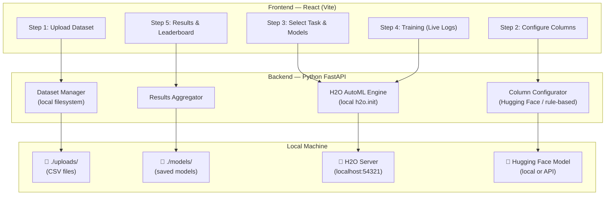
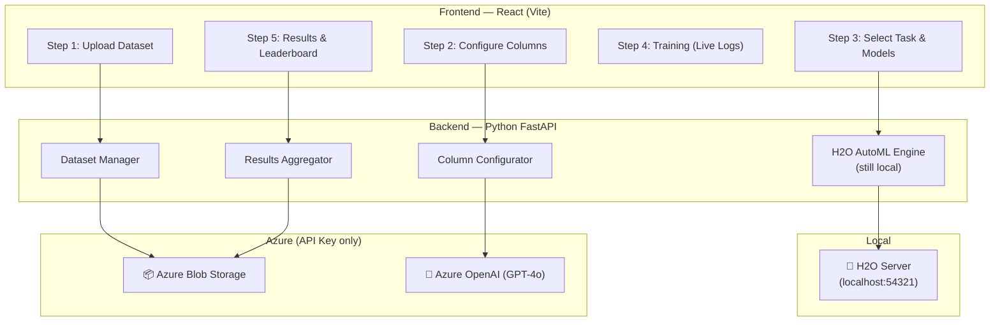

# AutoML Pipeline — Revised Implementation Plan (Local-First) 🚀

**Key Change:** The entire project works **WITHOUT Azure** using open-source tools.  
Azure (OpenAI + Blob Storage only) is integrated in **Week 2** when access is granted.

---

## ✅ Answer: YES — You Can Complete This Fully Without Azure

| Feature | Without Azure (Week 1) | With Azure (Week 2) |
|---------|----------------------|---------------------|
| **ML Training** | H2O AutoML — runs locally | Same (H2O stays local) |
| **AI Assistant** | Hugging Face model (free, local) | Azure OpenAI GPT-4o |
| **File Storage** | Local filesystem (`./uploads/`) | Azure Blob Storage |
| **AI Column Recommendation** | Rule-based + Hugging Face | Azure OpenAI |
| **Model Persistence** | Save to local `./models/` folder | Azure Blob Storage |
| **Everything else** | Identical | Identical |

> [!IMPORTANT]
> **H2O AutoML will ALWAYS run locally** — your team is not giving Azure access for compute.
> Azure is only used for OpenAI (AI Assistant) and Blob Storage (file storage) after Week 1.

---

## Architecture — Week 1 (Fully Local)



## Architecture — Week 2 (Add Azure OpenAI + Blob)



---

## Tech Stack — Full Comparison

| Component | Week 1 (Local/Open-Source) | Week 2 (Add Azure) |
|-----------|--------------------------|---------------------|
| **ML Engine** | `pip install h2o` → `h2o.init()` | Same — H2O stays local |
| **AI Assistant** | Hugging Face `transformers` (free) OR Hugging Face Inference API (free tier) | Azure OpenAI GPT-4o (API key) |
| **File Storage** | Local `./uploads/` folder | Azure Blob Storage (API key) |
| **Model Storage** | Local `./models/` folder | Azure Blob Storage (API key) |
| **Backend** | Python FastAPI | Same |
| **Frontend** | React + Vite | Same |
| **Charts** | Recharts (frontend) | Same |
| **Real-time Logs** | WebSocket (FastAPI) | Same |
| **Data Processing** | Pandas, NumPy | Same |

---

## Open-Source AI Assistant Alternatives (Replace Azure OpenAI)

### Option 1: Hugging Face Inference API (Recommended — Easiest)

Free tier, no GPU needed, works like an API call:

```python
# pip install huggingface_hub
from huggingface_hub import InferenceClient

client = InferenceClient(
    model="mistralai/Mistral-7B-Instruct-v0.3",
    token="hf_YOUR_FREE_TOKEN"  # Get from huggingface.co/settings/tokens
)

response = client.chat_completion(
    messages=[
        {"role": "system", "content": "You are a data science assistant. Given dataset columns, recommend target variable and features."},
        {"role": "user", "content": """
            Use case: Classify beneficiaries in 2010_11
            Columns: sl_no_(object), name_of_district(object), 
            beneficiaries_2010_11(float64), beneficiaries_2011_12(float64)...
            Which column should be target? Which features?
        """}
    ],
    max_tokens=500
)
print(response.choices[0].message.content)
```

**Cost: FREE** (rate limited to ~1000 requests/day)

### Option 2: Rule-Based Fallback (No AI needed)

```python
def recommend_target(columns_info):
    """Simple rule-based target recommendation"""
    # Rule 1: If user mentions a column name in use case, pick that
    # Rule 2: Prefer numeric columns with few unique values (classification)
    # Rule 3: Exclude ID-like columns (sl_no, id, index)
    # Rule 4: Prefer columns mentioned last in dataset (often the target)
    
    scores = {}
    for col in columns_info:
        score = 0
        if col['type'] in ['float64', 'int64']:
            score += 2
        if col['name'].startswith(('id', 'sl_no', 'index')):
            score -= 10  # Exclude IDs
        if col['unique_count'] < 10:
            score += 3  # Good for classification
        scores[col['name']] = score
    
    target = max(scores, key=scores.get)
    features = [c['name'] for c in columns_info if c['name'] != target]
    return target, features
```

**Cost: FREE, no internet needed**

### Week 2 Switch (1-line change):

```python
# config.py
USE_AZURE_OPENAI = os.getenv("AZURE_OPENAI_API_KEY") is not None

# service.py
if USE_AZURE_OPENAI:
    # Use Azure OpenAI
    response = azure_client.chat.completions.create(...)
else:
    # Use Hugging Face (free)
    response = hf_client.chat_completion(...)
```

---

## Step-by-Step Pipeline with Tools (Revised)

| Step | Process | Week 1 Tools (Local) | Week 2 Tools (+ Azure) |
|------|---------|---------------------|------------------------|
| **1. Data Ingestion** | Upload CSV, store, extract metadata | FastAPI, Pandas, Local FS | + Azure Blob Storage |
| **2. Data Profiling** | Column stats, types, nulls, distributions | Pandas, NumPy | Same |
| **3. Column Config** | AI-recommended target & features | Hugging Face / Rule-based | Azure OpenAI GPT-4o |
| **4. Task Selection** | Classification / Regression / Clustering | H2O AutoML (local) | Same |
| **5. Model Config** | Select algorithms, hyperparameters, CV folds | H2O AutoML (local) | Same |
| **6. Training** | Auto train multiple models, live progress | H2O AutoML (local), WebSocket | Same |
| **7. Leaderboard** | Rank models by metric, find best | H2O Leaderboard | Same |
| **8. Feature Importance** | Top contributing features | H2O varimp(), Recharts | Same |
| **9. Visualization** | Confusion matrix, charts, comparison | Matplotlib, Recharts | Same |
| **10. Model Export** | Save models, export results | Local FS, H2O save_model | + Azure Blob Storage |

---

## Two-Week Sprint Plan (Revised)

### Week 1: Fully Local — No Azure Needed (April 2–8)

| Day | Date | Tasks | Tools Used |
|-----|------|-------|------------|
| **1** | Apr 2 | Project setup: FastAPI + Vite React, install H2O, test `h2o.init()` | Python, Node.js, H2O, Java |
| **2** | Apr 3 | Backend: Dataset upload API (local FS), Frontend: Wizard stepper + Step 1 | FastAPI, Pandas, React |
| **3** | Apr 4 | Backend: Column analysis + Hugging Face AI recommendation, Frontend: Step 2 | Hugging Face API, Pandas |
| **4** | Apr 5 | Backend: H2O AutoML training endpoint, Frontend: Step 3 (task/model cards) | H2O AutoML, React |
| **5** | Apr 6 | Backend: WebSocket for live logs, Frontend: Step 4 (progress + log terminal) | FastAPI WebSocket, React |
| **6** | Apr 7 | Backend: Results/leaderboard API, Frontend: Step 5 (leaderboard table) | H2O Leaderboard, Recharts |
| **7** | Apr 8 | End-to-end smoke test with iris.csv, bug fixes | All local tools |

> **Week 1 Milestone:** Full pipeline working — upload → configure → train → results. All local. ✅

### Week 2: Add Azure + Polish (April 9–15)

| Day | Date | Tasks | Tools Used |
|-----|------|-------|------------|
| **8** | Apr 9 | Integrate Azure Blob Storage (dataset upload/download) | azure-storage-blob |
| **9** | Apr 10 | Integrate Azure OpenAI (replace Hugging Face with GPT-4o) | openai SDK |
| **10** | Apr 11 | Feature importance charts, confusion matrix, model comparison viz | Recharts, Matplotlib |
| **11** | Apr 12 | Clustering support, cross-validation results display | H2O, Recharts |
| **12** | Apr 13 | UI polish — match AI Kosh theme, animations, responsive design | CSS, React |
| **13** | Apr 14 | Error handling, edge cases, model export to Blob | All |
| **14** | Apr 15 | Full integration testing (3+ datasets), final bug fixes | All |

> **Week 2 Milestone:** Azure integrated, polished UI, tested with multiple datasets. ✅

---

## Project Structure

```
ai-kosh-automl/
├── backend/
│   ├── app/
│   │   ├── main.py                  # FastAPI entry point
│   │   ├── config.py                # Toggle: local vs Azure mode
│   │   ├── routers/
│   │   │   ├── datasets.py          # Upload, list, preview
│   │   │   ├── configure.py         # Column config + AI recommend
│   │   │   ├── training.py          # H2O training + WebSocket
│   │   │   └── results.py           # Leaderboard, metrics, charts
│   │   ├── services/
│   │   │   ├── storage_local.py     # Week 1: local filesystem
│   │   │   ├── storage_azure.py     # Week 2: Azure Blob
│   │   │   ├── ai_huggingface.py    # Week 1: Hugging Face
│   │   │   ├── ai_azure_openai.py   # Week 2: Azure OpenAI
│   │   │   ├── h2o_engine.py        # H2O AutoML (always local)
│   │   │   └── data_processor.py    # Pandas data analysis
│   │   └── models/
│   │       └── schemas.py           # Pydantic models
│   ├── uploads/                     # Week 1: CSV files stored here
│   ├── models/                      # Week 1: Saved H2O models
│   ├── requirements.txt
│   └── .env
├── frontend/
│   ├── src/
│   │   ├── App.jsx
│   │   ├── index.css
│   │   ├── components/
│   │   │   ├── Wizard/
│   │   │   │   ├── WizardStepper.jsx
│   │   │   │   ├── StepSelectDataset.jsx
│   │   │   │   ├── StepConfigureData.jsx
│   │   │   │   ├── StepConfiguration.jsx
│   │   │   │   ├── StepTraining.jsx
│   │   │   │   └── StepResults.jsx
│   │   │   └── Charts/
│   │   │       ├── Leaderboard.jsx
│   │   │       ├── FeatureImportance.jsx
│   │   │       └── ModelComparison.jsx
│   │   └── services/
│   │       └── api.js
│   └── package.json
├── data/                            # Sample test datasets
│   ├── iris.csv
│   └── housing.csv
└── README.md
```

### Key Design: Storage & AI are Swappable

```python
# config.py — ONE toggle switches between local and Azure

import os

# Auto-detect: if Azure keys exist, use Azure; otherwise use local
STORAGE_MODE = "azure" if os.getenv("AZURE_STORAGE_CONNECTION_STRING") else "local"
AI_MODE = "azure" if os.getenv("AZURE_OPENAI_API_KEY") else "huggingface"

# Week 1 .env (no Azure keys → everything local)
# HUGGINGFACE_TOKEN=hf_xxxx   (optional, free)

# Week 2 .env (add Azure keys → auto-switches)
# AZURE_STORAGE_CONNECTION_STRING=xxx
# AZURE_OPENAI_API_KEY=xxx
# AZURE_OPENAI_ENDPOINT=xxx
```

---

## Python Dependencies

```txt
# Core
fastapi==0.110.0
uvicorn==0.29.0
python-multipart==0.0.9
python-dotenv==1.0.1

# ML
h2o==3.46.0.2
pandas==2.2.1
numpy==1.26.4

# AI Assistant (Week 1 — free)
huggingface_hub==0.21.0

# AI Assistant (Week 2 — Azure)
openai==1.14.0

# Storage (Week 2 — Azure)
azure-storage-blob==12.19.0

# Real-time
websockets==12.0

# Visualization
matplotlib==3.8.3

# Frontend communications
aiofiles==23.2.1
```

---

## What You Can Do TODAY (Day 1 Setup)

```bash
# 1. Create project folder
mkdir ai-kosh-automl
cd ai-kosh-automl

# 2. Create backend
mkdir backend
cd backend
python -m venv venv
venv\Scripts\activate          # Windows
pip install fastapi uvicorn h2o pandas numpy huggingface_hub python-dotenv python-multipart websockets matplotlib

# 3. Test H2O works
python -c "import h2o; h2o.init(); print('H2O is working!'); h2o.cluster().shutdown()"

# 4. Create frontend
cd ..
npx -y create-vite@latest frontend -- --template react
cd frontend
npm install
npm install recharts axios

# 5. Run both
# Terminal 1: cd backend && uvicorn app.main:app --reload
# Terminal 2: cd frontend && npm run dev
```

---

## Summary: What Changes Between Week 1 and Week 2

| Component | Week 1 Code | Week 2 Change | Effort |
|-----------|-------------|---------------|--------|
| **Storage** | `storage_local.py` → saves to `./uploads/` | Add `storage_azure.py` → saves to Blob | ~2 hours |
| **AI Assistant** | `ai_huggingface.py` → uses free HF API | Add `ai_azure_openai.py` → uses GPT-4o | ~2 hours |
| **H2O AutoML** | `h2o.init()` — runs locally | **NO CHANGE** — stays local | 0 hours |
| **Config toggle** | `STORAGE_MODE=local`, `AI_MODE=huggingface` | `STORAGE_MODE=azure`, `AI_MODE=azure` | 1 minute |
| **Everything else** | Frontend, WebSocket, charts, wizard | **NO CHANGE** | 0 hours |

> [!TIP]
> **Total effort to add Azure in Week 2: ~4 hours.** The rest of Week 2 is for polish, testing, and visualization improvements.
