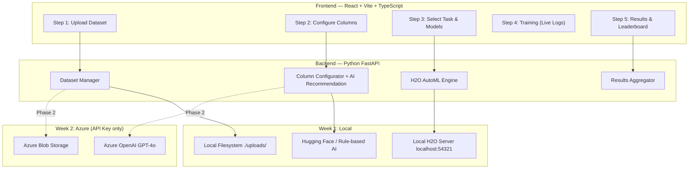

# AI Kosh AutoML Pipeline — Complete Project Documentation

**Project:** End-to-End Automated Machine Learning Pipeline with H2O AutoML & Azure  
**Organization:** NTT DATA — AI Kosh Platform (Team 1: AutoML Wizard)  
**Timeline:** 2 Weeks (April 2 – April 16, 2026)  
**Date Documented:** April 3, 2026

---

## 1. Project Overview

### What Is This Project?

This project is an **AutoML Wizard** — a web application that enables users to:

1. **Upload** a CSV dataset
2. **Configure** target and feature columns (with AI-assisted recommendations)
3. **Select** the ML task type (Classification / Regression / Clustering) and algorithms
4. **Train** multiple ML models automatically using H2O AutoML
5. **View** a ranked leaderboard identifying the best-fitting model

The application is modeled after the **NTT DATA AI Kosh** platform's AutoML tool and follows a **5-step wizard** UI pattern.

> [!IMPORTANT]
> **Scope:** Model selection & comparison only — **no model deployment**. The goal is purely **model discovery**: finding which algorithm works best for a given dataset.

---

## 2. Architecture



### Key Design Decision: Swappable Services

The architecture uses a **strategy pattern** to make storage and AI services interchangeable. A single `.env` toggle auto-switches between local and Azure:

```python
# config.py — Auto-detection
STORAGE_MODE = "azure" if os.getenv("AZURE_STORAGE_CONNECTION_STRING") else "local"
AI_MODE = "azure" if os.getenv("AZURE_OPENAI_API_KEY") else "huggingface"
```

This means:
- **Week 1:** Everything runs locally — no Azure needed
- **Week 2:** Add Azure API keys to `.env` → system auto-switches with zero code changes

---

## 3. Technology Stack

| Layer | Technology | Purpose |
|-------|-----------|---------|
| **Frontend** | React 19 + Vite 8 + TypeScript | 5-step wizard UI |
| **UI Charts** | Recharts 3.8 | Leaderboard, feature importance, model comparison |
| **HTTP Client** | Axios | Frontend-to-backend API communication |
| **Backend** | Python FastAPI | REST API + WebSocket server |
| **ML Engine** | H2O AutoML (Java-based) | Algorithm selection, hyperparameter tuning, cross-validation |
| **AI Assistant (Phase 1)** | Hugging Face Mistral-7B + Rule-based fallback | Column/target recommendation |
| **AI Assistant (Phase 2)** | Azure OpenAI GPT-4o | Smarter column/target recommendation |
| **Storage (Phase 1)** | Local filesystem | CSV files in `./shared_workspace/1_raw_uploads/` |
| **Storage (Phase 2)** | Azure Blob Storage | Cloud file persistence |
| **Database** | SQLite | Dataset metadata & training run tracking |
| **Data Processing** | Pandas, NumPy, scikit-learn | Data profiling, validation |
| **Real-time** | WebSocket (FastAPI built-in) | Live training logs streaming |
| **Visualization** | Matplotlib | Backend chart generation |

### Prerequisites

| Tool | Version | Purpose |
|------|---------|---------|
| Python | 3.10+ | Backend runtime |
| Java JDK | 17 (Eclipse Adoptium) | Required by H2O AutoML |
| Node.js | 18+ | Frontend build tool |

---

## 4. Complete File-by-File Implementation Breakdown

### 4.1 Backend — `AI_Kosh_Project/modules/team1_automl/`

The backend consists of **17 source files** organized into a clean modular architecture:

---

#### [config.py](file:///c:/Users/HP/Desktop/AI%20kosh/AI_Kosh_Project/modules/team1_automl/config.py) — Configuration Hub

- Loads environment variables from `.env` via `python-dotenv`
- **Auto-detects** whether to use local or Azure mode based on presence of API keys
- Defines all directory paths: `RAW_UPLOADS_DIR`, `PROCESSED_DATA_DIR`, `MODELS_DIR`
- H2O defaults: `max_models=20`, `max_runtime_secs=300`, `nfolds=5`, `seed=42`
- Creates required directories on startup

---

#### [router.py](file:///c:/Users/HP/Desktop/AI%20kosh/AI_Kosh_Project/modules/team1_automl/router.py) — API Endpoint Definitions

All endpoints prefixed with `/team1`. It's a thin layer that delegates to `services.py`:

| Method | Endpoint | Description |
|--------|----------|-------------|
| `POST` | `/team1/datasets/upload` | Upload CSV file |
| `GET` | `/team1/datasets` | List all datasets |
| `GET` | `/team1/datasets/{id}/preview` | Preview first N rows |
| `GET` | `/team1/datasets/{id}/columns` | Column metadata (types, nulls, uniques) |
| `DELETE` | `/team1/datasets/{id}` | Remove dataset |
| `POST` | `/team1/configure/ai-recommend` | AI column recommendation |
| `POST` | `/team1/configure/validate` | Validate target/features config |
| `POST` | `/team1/training/start` | Start H2O AutoML training |
| `GET` | `/team1/training/{run_id}/status` | Training progress |
| `POST` | `/team1/training/{run_id}/stop` | Stop training |
| `WS` | `/team1/ws/training/{run_id}` | Live training logs (WebSocket) |
| `GET` | `/team1/results/{run_id}/leaderboard` | Ranked model leaderboard |
| `GET` | `/team1/results/{run_id}/best-model` | Best model + feature importance |
| `GET` | `/team1/results/{run_id}/feature-importance` | Top features |
| `GET` | `/team1/results/{run_id}/confusion-matrix` | Confusion matrix (classification) |
| `GET` | `/team1/results/{run_id}/residuals` | Residual data (regression) |
| `GET` | `/team1/results/{run_id}/export` | Download results as CSV/JSON |

---

#### [services.py](file:///c:/Users/HP/Desktop/AI%20kosh/AI_Kosh_Project/modules/team1_automl/services.py) — Business Logic Orchestrator (435 lines)

The **largest file** — the brain of the backend. Handles:

- **Dataset lifecycle**: Upload → store → metadata → preview → columns → delete
- **AI recommendation**: Delegates to the active AI service (HuggingFace or Azure)
- **Training orchestration**: 
  - Creates a training run with UUID
  - Launches `_run_training()` as an async background task
  - Manages training pipeline stages: `QUEUED → DATA_CHECK → FEATURES → TRAINING → EVALUATION → COMPLETE`
  - Broadcasts progress updates via WebSocket to all connected clients
  - Saves model artifacts and leaderboard results
- **Results extraction**: Leaderboard, best model, feature importance, confusion matrix, residuals, CSV/JSON export

Key implementation detail: Uses `asyncio.create_task()` to run H2O training in a thread executor (`loop.run_in_executor`) since H2O is blocking — this prevents the API from hanging during training.

---

#### [h2o_engine.py](file:///c:/Users/HP/Desktop/AI%20kosh/AI_Kosh_Project/modules/team1_automl/h2o_engine.py) — H2O AutoML Wrapper (194 lines)

Thread-safe wrapper around the H2O Python client:

- `init_h2o()`: Thread-safe H2O cluster initialization with `max_mem_size=2G`
- `run_automl()`: Configures and runs `H2OAutoML` with:
  - Target type detection (auto-converts to factor for classification)
  - Algorithm filtering (DRF, GLM, XGBoost, GBM, DeepLearning, StackedEnsemble)
  - Cross-validation (k-fold)
  - `sort_metric="AUTO"` (AUC for classification, RMSE for regression)
- `get_leaderboard()`: Extracts ranked model results as list of dicts
- `get_variable_importance()`: Feature importance from best model
- `get_confusion_matrix()`: Confusion matrix extraction for classification
- `get_model_metrics()`: Full metrics extraction (AUC, Accuracy, F1, RMSE, MAE, R², etc.)
- `save_model()` / `load_model()`: H2O model persistence

---

#### [data_processor.py](file:///c:/Users/HP/Desktop/AI%20kosh/AI_Kosh_Project/modules/team1_automl/data_processor.py) — Pandas Data Analysis

- `get_metadata()`: Extracts row count, column count, file size
- `get_preview()`: Returns first N rows as dict records
- `get_columns()`: Column profiling — dtype, null count, unique count, sample values
- `validate_config()`: Smart validation:
  - Checks target/features exist in dataset
  - Warns if target has >50 unique values for classification (suggests regression)
  - Warns if target is categorical for regression (suggests classification)

---

#### [ai_huggingface.py](file:///c:/Users/HP/Desktop/AI%20kosh/AI_Kosh_Project/modules/team1_automl/ai_huggingface.py) — Open-Source AI Assistant (Phase 1)

Two-tier recommendation system:

1. **Hugging Face Inference API** (if `HUGGINGFACE_TOKEN` is set):
   - Uses `Mistral-7B-Instruct-v0.3` via `huggingface_hub.InferenceClient`
   - Sends column metadata + use case → gets structured JSON recommendation
   - Validates response against actual column names
   - Falls back to rule-based if HF response is invalid

2. **Rule-based fallback** (always available, no API needed):
   - Scores columns based on: keyword match with use case, data type (numeric preferred), unique count (2-20 = good for classification), exclusion of ID-like columns
   - Returns highest-scoring column as target, rest as features

---

#### [ai_azure_openai.py](file:///c:/Users/HP/Desktop/AI%20kosh/AI_Kosh_Project/modules/team1_automl/ai_azure_openai.py) — Azure OpenAI (Phase 2)

- Uses `AzureOpenAI` client from `openai` SDK
- Sends formatted column info + use case to GPT-4o deployment
- Parses structured JSON response with target, features, and reasoning
- Validates response columns against actual dataset columns

---

#### [storage_local.py](file:///c:/Users/HP/Desktop/AI%20kosh/AI_Kosh_Project/modules/team1_automl/storage_local.py) — Local File Storage

- Saves datasets to `shared_workspace/1_raw_uploads/{dataset_id}/{filename}`
- Saves models to `shared_workspace/3_models/{run_id}/`
- Simple filesystem operations: `write_bytes`, `shutil.rmtree`, `iterdir`

---

#### [storage_azure.py](file:///c:/Users/HP/Desktop/AI%20kosh/AI_Kosh_Project/modules/team1_automl/storage_azure.py) — Azure Blob Storage (Phase 2)

- Uses `azure.storage.blob.BlobServiceClient`
- **Dual-write**: Uploads to Azure Blob AND saves local copy (for H2O to read)
- **Smart download**: Checks local cache first, downloads from Blob only if missing
- Auto-creates containers (`datasets`, `models`) on first use
- Supports: upload, download, delete, list for both datasets and models

---

#### [storage_service.py](file:///c:/Users/HP/Desktop/AI%20kosh/AI_Kosh_Project/modules/team1_automl/storage_service.py) — Storage Factory

```python
def get_storage():
    if STORAGE_MODE == "azure":
        return AzureStorage()
    else:
        return LocalStorage()
```

---

#### [ai_service.py](file:///c:/Users/HP/Desktop/AI%20kosh/AI_Kosh_Project/modules/team1_automl/ai_service.py) — AI Factory

```python
def get_ai_service():
    if AI_MODE == "azure":
        return ai_azure_openai
    else:
        return ai_huggingface
```

---

#### [schemas.py](file:///c:/Users/HP/Desktop/AI%20kosh/AI_Kosh_Project/modules/team1_automl/schemas.py) — Pydantic Data Models

13 Pydantic models for request/response validation:

| Model | Purpose |
|-------|---------|
| `DatasetMetadata` | Dataset info (id, filename, rows, columns, size) |
| `ColumnInfo` | Column profile (name, dtype, nulls, uniques, samples) |
| `DatasetColumnsResponse` | List of column infos |
| `DatasetPreviewResponse` | Preview rows |
| `AIRecommendRequest/Response` | AI column recommendation I/O |
| `ValidateConfigRequest/Response` | Configuration validation |
| `TrainingStartRequest` | Full training config (target, features, task, models, hyperparams) |
| `TrainingStartResponse` | Run ID + status |
| `TrainingStatusResponse` | Progress + stage + message |
| `ModelResult` | Single model metrics + rank |
| `LeaderboardResponse` | Full ranked leaderboard |
| `FeatureImportanceResponse` | Top features list |
| `ConfusionMatrixResponse` / `ResidualsResponse` | Visualization data |

---

#### [enums.py](file:///c:/Users/HP/Desktop/AI%20kosh/AI_Kosh_Project/modules/team1_automl/enums.py) — Enumeration Types

| Enum | Values |
|------|--------|
| `MLTask` | classification, regression, clustering |
| `ModelType` | DRF, GLM, XGBoost, GBM, DeepLearning, StackedEnsemble |
| `TrainingStatus` | queued, data_check, features, training, evaluation, complete, failed, stopped |
| `StorageMode` | local, azure |
| `AIMode` | huggingface, azure |

Also includes `MODEL_INFO` dict with display names, speed ratings, and descriptions for each algorithm.

---

#### [team_db.py](file:///c:/Users/HP/Desktop/AI%20kosh/AI_Kosh_Project/modules/team1_automl/team_db.py) — SQLite Database

Two tables:

```sql
datasets (id, filename, total_rows, total_columns, size_bytes, category, description)
training_runs (run_id, dataset_id, config, status, created_at, updated_at)
```

Auto-creates on module import via `init_db()`. Stores dataset metadata and training run history.

---

#### [run_local.py](file:///c:/Users/HP/Desktop/AI%20kosh/AI_Kosh_Project/modules/team1_automl/run_local.py) — Standalone Server

Independent test server for Team 1's module:
- Creates a FastAPI app with CORS middleware (allows all origins)
- Includes the team1 router
- Runs on `http://localhost:8001` with Swagger docs at `/docs`
- Command: `python -m modules.team1_automl.run_local`

---

### 4.2 Frontend — `UI_kosh/src/pages/model-exchange/tools/`

The frontend consists of **9 source files** built with React 19 + TypeScript + Vite 8:

---

#### [AutoMLWizard.tsx](file:///c:/Users/HP/Desktop/AI%20kosh/UI_kosh/src/pages/model-exchange/tools/AutoMLWizard.tsx) — Main Wizard Container (162 lines)

The root component managing all wizard state:
- **State management**: 12 `useState` hooks tracking dataset, columns, target, features, ML task, models, hyperparameters, run ID
- **Step navigation**: 5 steps (0-4) with completion tracking
- **Lifecycle flow**:
  1. `handleDatasetSelect` → Fetches columns → advances to Step 1
  2. `handleConfigContinue` → advances to Step 2
  3. `handleStartTraining` → POSTs training request → gets run_id → advances to Step 3
  4. `handleTrainingComplete` → advances to Step 4 (results)
  5. `handleReset` → Clears all state, returns to Step 0

---

#### [WizardStepper.tsx](file:///c:/Users/HP/Desktop/AI%20kosh/UI_kosh/src/pages/model-exchange/tools/components/WizardStepper.tsx) — Step Navigation Bar

5-step stepper component with:
- Step icons (📁, ⚙, 🔧, ▶, 📊)
- Visual states: completed (green check), active (orange), upcoming (gray)
- Click-to-navigate for completed steps

---

#### [StepSelectDataset.tsx](file:///c:/Users/HP/Desktop/AI%20kosh/UI_kosh/src/pages/model-exchange/tools/components/StepSelectDataset.tsx) — Step 1: Upload Dataset

- **File upload**: Drag-and-drop CSV upload with progress
- **Dataset catalog**: Lists previously uploaded datasets
- **Metadata display**: Total rows, columns, size, category

---

#### [StepConfigureData.tsx](file:///c:/Users/HP/Desktop/AI%20kosh/UI_kosh/src/pages/model-exchange/tools/components/StepConfigureData.tsx) — Step 2: Column Configuration

- **Column table**: All columns with dtype, null count, unique count
- **Target selection**: Radio buttons to select target variable
- **Feature selection**: Checkboxes to include/exclude features
- **AI Assistant panel**: Text input for use case → AI recommendation with confidence + reasoning

---

#### [StepConfiguration.tsx](file:///c:/Users/HP/Desktop/AI%20kosh/UI_kosh/src/pages/model-exchange/tools/components/StepConfiguration.tsx) — Step 3: ML Task & Model Config

- **Auto Mode** toggle
- **ML Task cards**: Classification / Regression / Clustering
- **Model selection cards**: 6 algorithms with speed indicators (🟢 Fast, 🟠 Medium, 🔴 Slow)
- **Hyperparameters**: Train/Test split, Cross-validation folds, Max models, Max runtime

---

#### [StepTraining.tsx](file:///c:/Users/HP/Desktop/AI%20kosh/UI_kosh/src/pages/model-exchange/tools/components/StepTraining.tsx) — Step 4: Live Training

- **Progress pipeline**: Visual stages (Queued → Data Check → Features → Training → Evaluation → Complete)
- **Progress bar**: Real-time percentage
- **Live training logs**: Dark terminal-style log viewer via WebSocket
- **Auto-advance**: Automatically moves to Results when training completes

---

#### [StepResults.tsx](file:///c:/Users/HP/Desktop/AI%20kosh/UI_kosh/src/pages/model-exchange/tools/components/StepResults.tsx) — Step 5: Results

- **Model leaderboard**: Ranked table sorted by primary metric
- **Best model badge**: Top model highlighted
- **Feature importance**: Bar chart of top features
- **Export**: Download results as CSV or JSON

---

#### [types.ts](file:///c:/Users/HP/Desktop/AI%20kosh/UI_kosh/src/pages/model-exchange/tools/types.ts) — TypeScript Type Definitions

All TypeScript interfaces matching the backend Pydantic schemas, plus:
- `WizardStep` type (0–4)
- `WizardState` interface
- `MODEL_INFO` constant with display metadata for each algorithm

---

#### [api.ts](file:///c:/Users/HP/Desktop/AI%20kosh/UI_kosh/src/pages/model-exchange/tools/api.ts) — API Client

Axios-based client with all 14+ API functions:
- Base URL configurable via `VITE_API_URL` env variable (defaults to `http://localhost:8001`)
- WebSocket URL helper that converts `http://` to `ws://`
- Full CRUD for datasets, AI recommendation, training, results, export

---

#### [useWebSocket.ts](file:///c:/Users/HP/Desktop/AI%20kosh/UI_kosh/src/pages/model-exchange/tools/hooks/useWebSocket.ts) — WebSocket Hook

Custom React hook for real-time training log streaming:
- Connects to `/team1/ws/training/{run_id}`
- Parses incoming JSON messages
- Exposes: logs array, connection status, current stage/progress

---

#### [AutoMLWizard.css](file:///c:/Users/HP/Desktop/AI%20kosh/UI_kosh/src/pages/model-exchange/tools/AutoMLWizard.css) — Styles (18KB)

All styles use the `aw-` prefix (AutoML Wizard) to avoid conflicts. Implements:
- AI Kosh orange/white/dark-header theme
- Card-based layout for model selection
- Terminal-style log viewer
- Responsive design
- Step indicator animations

---

## 5. ML Pipeline — End-to-End Flow

| Step | Process | Tools Used |
|------|---------|------------|
| **1. Data Ingestion** | Upload CSV, store locally (or Azure Blob), extract metadata | FastAPI, Pandas, Local FS / Azure Blob |
| **2. Data Profiling** | Column stats: data types, null counts, unique values, sample values | Pandas, NumPy |
| **3. Column Config** | AI-recommended target & features based on use case description | Hugging Face Mistral-7B / Azure OpenAI / Rule-based |
| **4. Task Selection** | User selects Classification, Regression, or Clustering | H2O AutoML |
| **5. Model Config** | Select algorithms, set train/test split, CV folds, max models, max runtime | H2O AutoML |
| **6. Training** | Auto train multiple models with live progress via WebSocket | H2O AutoML, FastAPI WebSocket |
| **7. Leaderboard** | Rank models by metric (AUC/Accuracy for classification, RMSE/R² for regression) | H2O Leaderboard |
| **8. Feature Importance** | Extract top contributing features from best model | H2O `varimp()` |
| **9. Evaluation** | Confusion matrix (classification), residual plots (regression), model comparison | H2O, Recharts |
| **10. Export** | Save model artifacts, export results as CSV/JSON | Local FS / Azure Blob, H2O `save_model` |

---

## 6. Supported ML Algorithms

| Algorithm | H2O Key | Speed | Description |
|-----------|---------|-------|-------------|
| Distributed Random Forest | `DRF` | 🟠 Medium | Ensemble of random decision trees |
| Generalized Linear Model | `GLM` | 🟢 Fast | Logistic/linear regression variant |
| XGBoost | `XGBoost` | 🟠 Medium | Gradient boosting framework |
| Gradient Boosting Machine | `GBM` | 🟠 Medium | H2O's native GBM implementation |
| Deep Learning | `DeepLearning` | 🔴 Slow | Neural network models |
| Stacked Ensemble | `StackedEnsemble` | 🔴 Slow | Meta-learner combining multiple models |

### Evaluation Metrics

**Classification:** AUC, Accuracy, F1 Score, Log Loss, Precision, Recall  
**Regression:** RMSE, MAE, R², MSE, RMSLE

---

## 7. Azure Integration Strategy

> [!NOTE]
> All Azure services are accessed via **API Key + Endpoint URL** only — no Azure AD, no managed identities, no complex IAM.

| Service | Purpose | Phase | Auth |
|---------|---------|-------|------|
| **Azure Blob Storage** | Store uploaded datasets & trained models | Phase 2 | Storage Account Connection String |
| **Azure OpenAI** | AI Assistant for column recommendation | Phase 2 | API Key + Endpoint |
| **H2O Server** | ML training engine | Always runs locally | No auth needed |

### Phase Transition

| Component | Phase 1 (Local) | Phase 2 (Azure) | Effort to Switch |
|-----------|-----------------|-----------------|-----------------|
| Storage | `storage_local.py` → `./uploads/` | `storage_azure.py` → Azure Blob | Add API key to `.env` |
| AI Assistant | `ai_huggingface.py` → Mistral-7B | `ai_azure_openai.py` → GPT-4o | Add API key to `.env` |
| H2O AutoML | `h2o.init()` — local | **NO CHANGE** — stays local | 0 effort |

---

## 8. Project Directory Structure

```
AI kosh/                                    ← Root workspace
├── AI_Kosh_Project/                        ← Backend
│   ├── .env                                ← Environment variables
│   ├── requirements.txt                    ← Python dependencies
│   ├── README.md                           ← Setup & API docs
│   ├── core/                               ← (Reserved for integration team)
│   ├── modules/
│   │   └── team1_automl/                   ← Team 1's AutoML module
│   │       ├── config.py                   ← Config hub + auto-detection
│   │       ├── router.py                   ← 17 API endpoints
│   │       ├── services.py                 ← Business logic (435 lines)
│   │       ├── h2o_engine.py               ← H2O AutoML wrapper (194 lines)
│   │       ├── data_processor.py           ← Pandas data analysis
│   │       ├── ai_huggingface.py           ← Open-source AI (Phase 1)
│   │       ├── ai_azure_openai.py          ← Azure OpenAI (Phase 2)
│   │       ├── storage_local.py            ← Local file storage
│   │       ├── storage_azure.py            ← Azure Blob storage (Phase 2)
│   │       ├── storage_service.py          ← Storage factory toggle
│   │       ├── ai_service.py               ← AI factory toggle
│   │       ├── schemas.py                  ← 13 Pydantic models
│   │       ├── enums.py                    ← 5 enums + model info
│   │       ├── team_db.py                  ← SQLite database
│   │       ├── run_local.py                ← Standalone test server
│   │       └── team1_automl.db             ← SQLite database file
│   └── shared_workspace/
│       ├── 1_raw_uploads/                  ← Uploaded CSV files
│       ├── 2_processed_data/               ← Exported results
│       └── 3_models/                       ← Saved H2O models
│
├── UI_kosh/                                ← Frontend
│   ├── package.json                        ← React 19, Vite 8, Recharts, Axios
│   ├── src/
│   │   ├── App.tsx                          ← App entry point
│   │   ├── main.tsx                         ← Vite entry point
│   │   └── pages/model-exchange/tools/     ← Team 1's UI code
│   │       ├── AutoMLWizard.tsx             ← Main wizard (162 lines)
│   │       ├── AutoMLWizard.css             ← All styles (18KB, aw- prefix)
│   │       ├── api.ts                       ← Axios API client
│   │       ├── types.ts                     ← TypeScript interfaces
│   │       ├── components/
│   │       │   ├── WizardStepper.tsx        ← 5-step navigation bar
│   │       │   ├── StepSelectDataset.tsx    ← Step 1: Upload
│   │       │   ├── StepConfigureData.tsx    ← Step 2: Columns + AI
│   │       │   ├── StepConfiguration.tsx   ← Step 3: Task/Models
│   │       │   ├── StepTraining.tsx         ← Step 4: Live training logs
│   │       │   └── StepResults.tsx          ← Step 5: Leaderboard
│   │       └── hooks/
│   │           └── useWebSocket.ts          ← WebSocket hook
│   └── .env                                ← VITE_API_URL
│
├── implementation_plan.md                  ← Full architecture & sprint plan (629 lines)
├── local_implementation_plan.md            ← Revised local-first plan (388 lines)
├── pipeline_steps_with_techstack.md        ← Pipeline + tech stack overview
├── task_summary_for_manager.md             ← Manager-facing task summary
├── azure_guide_for_beginners.md            ← Step-by-step Azure setup guide
├── h2o_docker_ssh_explained.md             ← H2O, Docker, SSH explainer
└── *.jpeg (1-12)                           ← Reference screenshots from AI Kosh platform
```

---

## 9. How to Run the Project

### 1. Set Java Path (required each terminal)

```powershell
$env:JAVA_HOME = "C:\Program Files\Eclipse Adoptium\jdk-17.0.18.8-hotspot"
$env:PATH = "$env:JAVA_HOME\bin;$env:PATH"
```

### 2. Start Backend

```powershell
cd "c:\Users\HP\Desktop\AI kosh\AI_Kosh_Project"
python -m modules.team1_automl.run_local
# → http://localhost:8001 (Swagger: http://localhost:8001/docs)
```

### 3. Start Frontend (new terminal)

```powershell
cd "c:\Users\HP\Desktop\AI kosh\UI_kosh"
npm run dev
# → http://localhost:5173
```

---

## 10. Documentation Created

Along with the code, the project includes **6 documentation files**:

| Document | Size | Purpose |
|----------|------|---------|
| [implementation_plan.md](file:///c:/Users/HP/Desktop/AI%20kosh/implementation_plan.md) | 26KB, 629 lines | Full architecture, API specs, sprint plan, risk assessment |
| [local_implementation_plan.md](file:///c:/Users/HP/Desktop/AI%20kosh/local_implementation_plan.md) | 14KB, 388 lines | Revised local-first plan (Week 1 without Azure) |
| [pipeline_steps_with_techstack.md](file:///c:/Users/HP/Desktop/AI%20kosh/pipeline_steps_with_techstack.md) | 3KB | 10-step pipeline with tools at each stage |
| [task_summary_for_manager.md](file:///c:/Users/HP/Desktop/AI%20kosh/task_summary_for_manager.md) | 2KB | Concise manager-facing summary |
| [azure_guide_for_beginners.md](file:///c:/Users/HP/Desktop/AI%20kosh/azure_guide_for_beginners.md) | 17KB | Step-by-step Azure setup with analogies |
| [h2o_docker_ssh_explained.md](file:///c:/Users/HP/Desktop/AI%20kosh/h2o_docker_ssh_explained.md) | 16KB | H2O, Docker, SSH concepts explained simply |

---

## 11. Code Statistics Summary

| Metric | Count |
|--------|-------|
| **Backend source files** | 17 files |
| **Frontend source files** | 9 files |
| **Total backend Python lines** | ~1,400 lines |
| **Total frontend TypeScript lines** | ~900 lines |
| **CSS lines** | ~700 lines |
| **API endpoints** | 17 endpoints (15 REST + 1 WebSocket + 1 root) |
| **Pydantic models** | 13 models |
| **Enums** | 5 enums |
| **Documentation files** | 6 files (~78KB total) |
| **Reference screenshots** | 12 images |

---

## 12. Current Project Status (as of April 3, 2026)

| Component | Status |
|-----------|--------|
| ✅ Project scaffolding | Complete |
| ✅ Backend API (all 17 endpoints) | Implemented |
| ✅ H2O AutoML integration | Implemented |
| ✅ AI Assistant (Hugging Face + Rule-based) | Implemented |
| ✅ Azure storage/AI code (Phase 2) | Written, ready to activate |
| ✅ Frontend wizard (all 5 steps) | Implemented |
| ✅ WebSocket live training logs | Implemented |
| ✅ SQLite metadata database | Implemented |
| ✅ Architecture documentation | Complete |
| ✅ UI polish & theming | AI Kosh orange/white/dark theme, animations, hover effects |
| ✅ Responsive design | `@media` breakpoints for mobile (768px) — grids collapse, sidebar stacks |
| ✅ Error handling & edge cases | HTTP 404/400, training failure recovery, AI fallback, config validation |
| 🔲 Azure services activation | Pending Azure access (just add API keys to `.env`) |

> [!TIP]
> The full pipeline (upload → configure → train → results) is fully implemented with local-first approach. Azure integration code is pre-written and ready to activate by adding API keys to `.env`. Sample test datasets (iris.csv, housing.csv, fe_data.csv) are included in `shared_workspace/sample_data/`.
